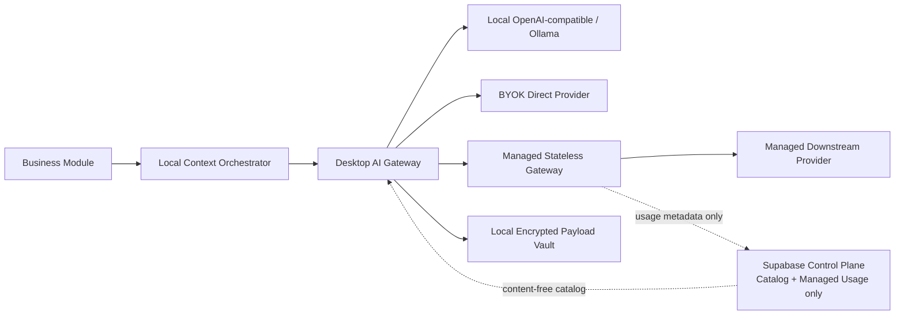
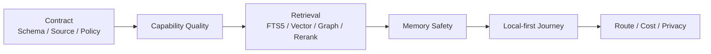

# DesignWan 本地优先 AI 契约、Route 与评测体系

版本：v2.0  
状态：MVP AI 开发基线  
适用范围：素材理解、需求解构、检索、命题、记忆候选、复盘  
关联文档：[本地优先架构](STACK_AND_ARCHITECTURE.md) · [本地数据模型](DATA_MODEL.md)

## 1. 结论先行

- AI 是不可信但有用的候选生成器，不是业务真相源或设计裁判。
- AI Gateway 在桌面 Main/Utility Worker 一侧统一三类 Route：Local、BYOK Direct、Managed Stateless。
- 业务正文、素材、记忆、Embedding、原始 Prompt/Response 默认只在设备。Supabase 控制面不得保存它们。
- Project 必须显式设置 `external_ai_policy`；没有授权时，外部 BYOK/Managed Route 不可用。
- ModelCatalog 只暴露通过 Capability + Prompt/Schema + Evals Approval 的模型。用户可设置默认和任务覆盖，但选择不是权限。
- Local Route 通过 OpenAI-compatible/Ollama Adapter 调用本机或用户明确配置的端点。
- BYOK Route 从 Electron KeyProtector 取用户密钥，由桌面 App 直连 Provider；密钥不进 Renderer、日志、控制面或 Managed Gateway。
- Managed Gateway 只中转 Request/Response，不持久化内容；只保存去内容化计费 Usage。下游 Provider 的保留政策仍需单独披露。
- `$15` Soft / `$20` Hard 只适用于 Managed Route。Local/BYOK 不计平台预算，但仍受 Capability、Policy、Evals 与 Provider 自身成本约束。
- 所有 Structured Output、Source、Scope、Memory、删除与 Route Policy 安全错误都是发布阻断项。

## 2. 数据路径与信任模型



### 2.1 本地内容面

以下只能在设备的 SQLite/Vault/LocalVectorIndex：

- Input References、Context Pack、Prompt Render、Tool Output；
- 原始 Provider Request/Response；
- Schema-validated Candidate；
- Asset/Fragment Embedding；
- Memory Candidate/Evidence；
- 用户接受、编辑、拒绝的内容反馈。

### 2.2 控制面

允许：

- Model/Provider/Capability、价格、Eval Approval、Route Availability；
- Managed Token/图片/调用单位、费用、状态、错误类别、Route/版本；
- 不可逆请求摘要与月度预算余额。

禁止：

- Project/Client/Asset/Memory 可关联内容；
- 文件名、URL、语义标签、Embedding；
- Prompt、Context、Response、Tool Trace；
- BYOK Key、Local Endpoint 和 Local/BYOK 完整 Usage。

## 3. AI 与 Domain 的 Seam

业务 Module 提交 Capability Request，Gateway 返回 Candidate：

```text
Business Module
  -> Capability Request
  -> Local Context Orchestrator
  -> Route Policy + ModelCatalog
  -> Local | BYOK | Managed Adapter
  -> Schema/Source Validation
  -> Candidate
  -> Domain Policy / User Confirmation
  -> Local Domain State
```

Gateway 不写 Confirmed Decision、Confirmed Memory 或 Graph 业务事实。原始 Provider 输出只能进入本地加密短保留 Payload。

## 4. Gateway Interface

请求字段：

| 字段 | 说明 |
|---|---|
| `capability` | 稳定能力名，如 `asset.analyze`、`memory.extract` |
| `actor_context` | Main 已验证的本地 Actor、Workspace、Project/Client Scope |
| `input_refs` | 本地 Entity/Object Ref，不接受任意文件路径 |
| `prompt_ref` | Prompt ID + 不可变版本 |
| `schema_ref` | Structured Output Schema + 版本 |
| `policy_ref` | Project AI/隐私/Route Policy Snapshot |
| `route_preference_ref` | 用户默认或任务覆盖引用；不接受任意字符串 |
| `latency_class` | interactive/background/batch |
| `idempotency_key` | 本地去重键 |
| `trace_context` | 本地 trace/request/job ID |

返回字段：

| 字段 | 说明 |
|---|---|
| `status` | succeeded/degraded/failed/cancelled/blocked |
| `candidate` | Schema Valid Candidate；失败为空 |
| `ai_run_id` | 本地 AIRun ID |
| `route` | local/byok/managed + 实际 Provider/Model |
| `usage` | Token/图片/工具/延迟/费用；平台计费标识 |
| `warnings` | 裁剪、Fallback、Provider Retention、降级 |
| `retryability` | retryable/non_retryable/manual_review |

Renderer 只看到必要状态；Provider Key、本地绝对路径、原始 Prompt/Response 不跨 Preload。

## 5. 三类 Route

### 5.1 Local Route

Adapter：

- OpenAI-compatible Local Adapter；
- Ollama Adapter；
- Deterministic Fake Adapter（测试）。

约束：

- 默认只允许 Loopback；若用户配置 LAN Endpoint，必须明确提示内容会离开本机并保存端点信任状态。
- 能力不能靠模型名称猜：启动时探测 Structured Output、Vision、Embedding、Context 与 Tool 能力。
- Local Model 可离线，但质量仍需本地 Eval Approval。
- Local Usage 只在本地记录，不进入平台 `$15/$20`。

### 5.2 BYOK Direct Route

- App 直连 OpenAI/Anthropic/Google 等 Provider Adapter。
- Key 由 KeyProtector 引用，Utility Worker 获得短生命周期使用能力，不获得可日志化明文。
- Provider Retention、Training、Region、Zero-retention Eligibility 逐 Catalog Entry 展示。
- BYOK Provider 费用由用户与供应商结算，不进入平台预算；产品仍记录本地估算，避免用户被自己的 Key 偷袭钱包。

### 5.3 Managed Stateless Route

Gateway 合同：

- Request/Response Body 只存在进程内短生命周期；
- 不进入数据库、对象存储、云 Queue、Log、Trace Attribute、Error Tracker、Analytics；
- 只记录 Usage ID、Provider/Model/Route Version、单位数、费用、状态/错误类别、不可逆请求摘要；
- 重试仅在请求生命周期内且有次数/成本上限；需要延后时由本地 Job 重新发起，云端不排正文队列；
- 下游 Provider Retention 单独披露，“DesignWan Gateway 无状态”不能偷换成“供应商绝不保留”。

Singapore `ap-southeast-1` 只属于 Supabase 控制面；Managed Gateway 与下游 Provider 的处理区域按 Route 记录，不得用控制面区域冒充 AI 内容区域。

## 6. Project Route Policy

`external_ai_policy`：

| 值 | 允许 |
|---|---|
| `deny` | 规则/手工/FTS5/Graph/既有本地索引；不调用 AI |
| `local_only` | 只允许本机或明确可信 Local Endpoint |
| `byok_allowed` | Local + BYOK；Managed 禁止 |
| `managed_allowed` | Local + Managed；BYOK 是否允许另看 Provider Allowlist |
| `explicit_route_allowlist` | 只允许列出的 Route/Provider/Model |

最终资格是：

```text
Project Policy
∩ Capability/Schema Compatibility
∩ Eval Approval
∩ Provider Retention/Region Requirement
∩ Route Reachability
∩ Managed Budget（仅 Managed）
```

任何子资源只能收紧。用户任务覆盖不能扩大 Project Policy。

## 7. ModelCatalog Deep Module

Interface：

| Interface | 输出 |
|---|---|
| `listEligibleModels(context, capability)` | 当前 Project/Route 可选 Catalog Entry、能力/成本/保留标签、不可用原因 |
| `resolveModel(selection, request)` | 获准 Route，或类型化阻断原因 |

隐藏：

- 控制面 Catalog 缓存、本地自定义模型；
- Provider Alias/Retirement/Pricing；
- Structured Output/JSON Schema、Vision、Text/Image Embedding、Tool、Context Flags；
- Prompt/Schema/Eval Approval；
- Project Policy、Route Reachability、Provider Retention；
- Managed Budget。

选择顺序：任务覆盖 > 用户 Capability 默认 > 产品批准默认。选择只保存 Catalog Entry ID。若退役、Policy 收紧或 Route 不可达，返回明确原因和 Eligible Alternatives，不静默换模型。

自动低成本 Fallback 仅在用户预先允许、同 Route/Policy、同 Schema/Eval 门均满足时发生，并标明实际模型。

## 8. Capability 划分

| Capability | 输入 | 输出 | Route |
|---|---|---|---|
| `asset.analyze` | 本地图片/Fragment + 最小文本 | 可见事实、OCR、结构/视觉候选 | Local/BYOK/Managed |
| `asset.embed_visual` | Asset/Fragment | 本地视觉向量 | 优先 Local；外部需项目授权 |
| `asset.describe_for_retrieval` | 已确认原因 + 分析 | 文本 Representation | 任一 Eligible Route/规则 |
| `requirement.analyze` | 需求片段 | 要求、模糊词、冲突、问题 | 任一 Eligible Route |
| `retrieval.query_understand` | Query + Project | 意图/过滤 | 规则/小模型 |
| `retrieval.rerank` | 已授权 Top-N | 排序与理由 | Local/BYOK/Managed；可降级 RRF |
| `proposition.draft` | 已确认需求/证据 | 命题候选/Trade-off | 任一 Eligible Route |
| `memory.extract` | 用户表达/Decision/Outcome | Memory Candidate | 任一 Eligible Route |
| `memory.consolidate` | 同 Scope 候选/记忆 | 合并/冲突建议 | 任一 Eligible Route |
| `project.review` | 决策/反馈/结果 | 可编辑复盘草稿 | 任一 Eligible Route |

Capability、Prompt、Schema、Eval 和预算独立版本化，不允许一个万能 Prompt 包打天下。

## 9. Prompt 与 Structured Output

目录：

```text
prompts/<capability>/vNNN/
├─ system.md
├─ task.md
├─ schema.json
├─ manifest.yaml
└─ changelog.md
```

Manifest 至少包含 Capability、Prompt/Schema Version、允许 Route/Model、Tool Allowlist、最大输入/输出、Source 规则、Eval Dataset 和状态。

输出 Envelope：

```text
schema_version
epistemic_type
claims[]
source_refs[]
uncertainties[]
warnings[]
```

规则：

- Source Ref 必须属于本次本地 Evidence Pack。
- `validated_conclusion` 不允许由模型输出。
- Schema 失败最多一次受限 Repair；仍失败则不写业务表。
- Prompt Injection 输入只作为 `untrusted_content`，不能覆盖 System Policy。
- Provider 原始输出只进本地加密 Payload，控制面/Managed Gateway 不保存。

## 10. Tool Calling

MVP Allowlist：

- `get_local_source_excerpt`
- `get_authorized_asset_summary`
- `retrieve_authorized_memories`
- `get_project_constraints`
- `calculate_deterministic_metrics`

约束：

- Tool 只能由桌面 Main/Utility Worker 执行，模型不能访问 SQLite、文件路径或 Shell。
- 参数只接受受控 ID；Main 重新校验 Actor/Project/Deletion 状态。
- Tool Output 有大小上限、最小化、Source Ref 与本地审计。
- Tool Error 不暴露堆栈、路径、Key 或 SQLite 细节。
- Managed Tool Round 仍会把 Tool Output 发给外部 Provider，必须再次受 Project Policy。

## 11. Vision、Embedding 与 Retrieval

### 11.1 Vision

- 原图从 AssetVault 解密为短生命周期内存/临时流。
- Local Route 不离设备；BYOK/Managed 只有 Project 明确授权才发送。
- 外部请求优先发送必要裁切/缩放，不默认发送整项目原件。
- 临时解密文件必须受控目录、自动清理、明文扫描覆盖。

### 11.2 Embedding

每条 Representation 本地记录：

- Entity/Version/Content Digest；
- Route/Model/Dimensions/Kind；
- Project/Client Scope；
- LocalVectorIndex Adapter/Index Version；
- AIRun Ref。

实际向量只在 LocalVectorIndex。即使向量由 BYOK/Managed Provider 计算，返回后也只落本地；控制面不保存。

### 11.3 混合召回

1. Main 恢复 Actor/Scope。
2. SQLite FTS5、LocalVectorIndex、Graph 并行生成已授权候选。
3. RRF 融合，不能直接比较不同信号原始分。
4. 可选 Rerank 只接收已授权 Top-N。
5. 返回 Why Recalled、Source、Scope、状态与反证。

T0 后 Registry Tombstone 必须防止 Vector Adapter 延迟删除造成泄漏。

## 12. Memory Policy

- AI 只能产生 Memory Candidate。
- 长期偏好、方法、能力、因果结论必须用户确认。
- Project/Client/Personal Scope 取最严格交集。
- Restricted Project 禁止外部 Route 时，Memory 提取只走 Local/规则或跳过。
- UserModel、Memory、Evidence 与向量只存在本地。
- Provider 切换不改变确认门和删除语义。

## 13. 降级策略

| 故障/限制 | 降级 | 禁止 |
|---|---|---|
| Local Model 不可达 | 选择其他已授权 Route或手工 | 自动把内容发云 |
| BYOK Key 无效 | 提示修复 Key/换 Eligible Route | 把 Key 发控制面 |
| Managed 不可达 | 本地排队或手工 | 云 Queue 持久化正文 |
| Schema 非法 | 一次 Repair 后失败 | 正则捞字段写主表 |
| Vision 失败 | 保存 Asset、用户手填 | 编造标签 |
| Embedding 失败 | FTS5 + Graph + Exact/既有索引 | 返回跨 Scope 缓存 |
| Rerank 失败 | RRF + 确定性多样性 | 丢弃所有检索结果 |
| Project 禁止外部 AI | Local/规则/手工 | 偷偷脱敏后发送 |
| Managed Soft Cap | 提醒、提供 Local/BYOK/低成本选项 | 强制偷换模型 |
| Managed Hard Cap | 停止新增 Managed 计费 Run；Local/BYOK/确定性能力继续 | 换模型/Fallback/重试绕过 |

## 14. Managed 成本控制

### 14.1 范围

- 仅 Managed Route 进入平台 Budget。
- 每用户 UTC 自然月 Soft `$15`、Hard `$20`。
- Local/BYOK `platform_billable=false`，不得进入 Managed Ledger。

### 14.2 原子预留

启动 Managed Run 前，本地与控制面共同使用 Idempotent Usage Authorization：

```text
settled + reserved + maximum_authorized_run_cost <= hard_limit
```

- 按授权最大成本预留，不用乐观平均值。
- 无可靠上界的 Managed Route 在 Beta 不自动执行。
- Provider 结算后追加 Settle/Release，历史 Ledger 不原地篡改。
- Fallback、Retry、Repair 均计入同一 Authorization。
- 控制面只看到 Usage 元数据，不看到内容。

### 14.3 Hard Cap 后

继续可用：

- 采集、整理、手工标注、项目/Decision/Memory 管理；
- FTS5、Graph、LocalVectorIndex；
- Local Route；
- BYOK Route；
- 已存在且未过期的本地派生结果。

## 15. 本地 AI 观测

本地 AIRun 记录：

- Route/Provider/Model/Prompt/Schema/Policy/Eval Version；
- 输入/输出单位、图片数、工具次数、成本；
- 状态、延迟、Retry/Fallback/Error Class；
- Source Validation、用户接受/编辑/拒绝；
- 加密 Payload Object Ref。

普通日志/Trace 禁止：

- Prompt/Response、客户原文、文件路径/URL；
- BYOK Key、Bridge Token、Embedding；
- 解密临时文件和 Tool Output。

Managed 控制面只接收最小 Usage；Local/BYOK 不上传内容化 Telemetry。

## 16. Eval 分层



### 16.1 Route Matrix

每个 Capability 至少按以下切片：

- Deterministic Fake；
- Local OpenAI-compatible/Ollama；
- BYOK Provider；
- Managed Provider；
- 规则/无 AI 降级。

不是所有模型都必须过所有 Capability，但用户可见的每个 Catalog Entry 必须能追溯到对应 Approval。

### 16.2 数据集

| Dataset | 覆盖 |
|---|---|
| `requirement-analysis-v1` | 品牌/网页视觉需求、模糊词、冲突、来源 |
| `asset-vision-v1` | 整图、Fragment、OCR、事实/推断 |
| `retrieval-qrels-v1` | FTS5/Exact/sqlite-vec/Graph/RRF/Rerank |
| `memory-policy-v1` | 自动写入、确认、Scope、冲突、删除 |
| `route-policy-v1` | Local/BYOK/Managed、Project Policy、Provider Retention |
| `local-privacy-v1` | Renderer/IPC、控制面 DLP、Vault、临时文件 |
| `managed-budget-v1` | `$15/$20`、并发预留、Retry/Fallback |
| `deletion-v1` | T0/T+7/T+8/T+30、离线/Pending/Exclusion |

## 17. 发布门

### 17.1 安全与契约硬门

| 指标 | 阈值 |
|---|---:|
| Structured Output Valid | 100%（含一次允许 Repair） |
| 非法/虚构 Source ID | 0 |
| Cross Workspace/Client/Project 泄漏 | 0 |
| Deleted Item Recall | 0 |
| 未确认高风险 Memory 进入长期召回 | 0 |
| Project 禁止时外部 AI 调用 | 0 |
| 未经 Capability/Eval Approval 模型调用 | 0 |
| 业务内容进入 Supabase 控制面 | 0 |
| Managed Gateway 内容持久化 | 0 |
| BYOK Key 进入 Renderer/日志/云 | 0 |
| Managed Hard Cap 后新增计费 Run | 0 |

### 17.2 质量门

| Capability | 指标 | MVP 门槛 |
|---|---|---:|
| Requirement | Epistemic Macro F1 | ≥ 0.90 |
| Requirement | Source Attribution Precision | ≥ 0.98 |
| Retrieval | nDCG@10 | ≥ 0.70 |
| Retrieval | Recall@20 | ≥ 0.85 |
| Memory Policy | 高风险需确认 Precision | ≥ 0.98 |
| Grounding | Grounded Claim Rate | ≥ 0.98 |
| Human | 核心 Case 平均分 | ≥ 4.0/5，且无 Critical Fail |

### 17.3 本地运行门

- sqlite-vec 候选 Adapter 与 Exact Oracle 的冻结 Fixture 差异在批准阈值内。
- Local/ BYOK/Managed 同 Schema 的业务语义一致；Route 差异被标注。
- 敏感 Fixture 不出现在 SQLite 明文、WAL、Temp、Log、Crash、控制面和 Managed Telemetry。
- Managed 成本/延迟相对批准基线无无解释重大回退。
- App 离线时本地确定性与已有索引 Journey 通过。

## 18. CI 与回归

| 阶段 | 内容 |
|---|---|
| PR | Fake Adapter、Schema/Policy/Source、SQLite Fixture、Exact Vector、IPC/Route Unit |
| Nightly | 真实 Local/BYOK/Managed、多次运行、质量/成本/隐私 |
| Release | Core + Holdout + Local-first E2E + 人工抽检 |
| Canary | Managed Usage/错误/成本；不采集业务内容 |

变更影响：

- Prompt/Model/Schema：对应 Capability + Source + Cost；
- LocalVectorIndex Adapter/Embedding：Exact Oracle + Retrieval + 删除；
- Route/Provider：Policy + Retention + Region + Schema + Cost；
- Managed Gateway：零持久化 DLP + Budget + Error Path；
- Memory Policy：Scope/Confirmation/Deletion；
- Electron IPC/Context：Local Privacy 全集。

## 19. M0 实施顺序

1. 建立 Desktop AI Gateway Interface、Deterministic Fake 和本地加密 AIRun/Payload。
2. 建立 Project `external_ai_policy` 与 Route Matrix。
3. 完成 Local OpenAI-compatible/Ollama Spike。
4. 完成 BYOK KeyProtector + Direct Provider Spike。
5. 完成 Managed Stateless Gateway 零持久化与 Usage Authorization Spike。
6. 建立 ModelCatalog/Capability/Eval Approval。
7. 完成 FTS5 + ExactVector 基线，再验证 sqlite-vec Adapter。
8. 建立 Requirement/Asset/Memory/Retrieval Dataset。
9. 跑 Local-first Journey：断网可用、外部 AI 显式授权、Managed Hard Cap、T0 删除。

验收不是“能调用三个模型”。真正的门槛是：用户知道内容走哪条 Route，业务数据默认留在设备，云控制面拿不到内容，结果有 Schema/Source/Scope，Managed 预算不可绕过，删除承诺不超过 App 实际可控制的范围。
