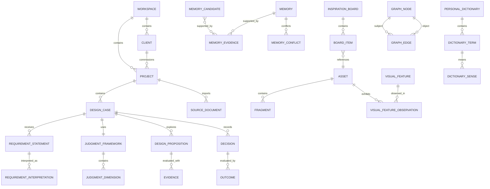

# DesignWan 领域模型

文档状态：MVP 本地优先开发基线 v2.0  
约束：Electron 模块化单体、SQLite + FTS5 + LocalVectorIndex、Encrypted Asset Vault、个人设备优先

相关文档：[数据模型](./DATA_MODEL.md) · [个人记忆系统](./MEMORY_SYSTEM.md) · [知识图谱本体](./KNOWLEDGE_GRAPH.md)

## 1. 建模目标与边界

DesignWan 的核心领域不是“收藏图片”，而是把设计师在真实项目中的素材、需求、证据、判断、决策和结果连接成可追溯、可修正、可再次调用的认知资产。

领域模型遵循四条硬规则：

1. **用户拥有最终判断权**：AI 只产生建议、候选或推断，不能伪装成事实或替用户做最终决策。
2. **来源优先于结论**：需求解释、关系、记忆和决策都必须能回到原始素材、原文、用户动作或模型运行。
3. **作用域先于召回**：任何跨项目召回都先通过 Workspace、Client、Project、Memory Scope 和隐私策略，再计算相关性。
4. **图谱不是第二套业务数据库**：业务聚合是事实源；GraphNode/GraphEdge 是关系层和查询投影，不能反向绕过业务规则篡改事实。
5. **设备是业务数据主权面**：素材、项目、记忆、Graph、Embedding 和原始 AI Payload 默认只在本机；云控制面不持有领域实体。

### 1.1 限界上下文

| 限界上下文 | 责任 | 事实源 | 不负责 |
|---|---|---|---|
| Identity & Workspace | 身份、成员、租户、权限、隐私默认值 | Workspace、Membership | 业务内容判断 |
| Capture & Asset | 幂等采集、来源、素材、局部、视觉特征、使用生命周期 | Capture、Asset、Fragment | 项目决策、长期记忆 |
| Project & Judgment | 客户、项目、需求解构、判断框架、命题、证据、决策、反馈、结果 | Project、DesignCase、Decision | 自动确认记忆 |
| Memory & Personalization | 记忆候选、确认、冲突、衰减、召回、删除、个人词典、用户模型 | Memory、PersonalDictionary | 修改项目历史 |
| Knowledge Graph | 有方向、有证据的关系断言、局部图查询、推理候选 | GraphEdge | 作为权限或业务真相源 |
| Retrieval | 权限过滤后的全文、向量、图邻居混合召回与解释 | 检索索引/投影 | 直接写入领域聚合 |
| AI Operations | Prompt/模型运行、结构化输出、成本、质量记录 | AIRun、PromptVersion | 绕过 Domain Policy 落库 |

### 1.2 深模块、Interface、Seam 与 Adapter

模块对调用方暴露少量高杠杆 Interface，复杂策略留在实现内。Interface 同时是调用面和测试面。

| 深模块 | 外部 Interface（概念级） | 主要隐藏行为 | Seam 与 Adapter |
|---|---|---|---|
| `CaptureModule` | `capture(command)`、`getStatus(id)` | 幂等、去重、来源规范化、异步编排 | 浏览器插件/上传是调用方；网页抓取为外部端口，生产 HTTP Adapter + 测试 Fixture Adapter |
| `AssetModule` | `annotate(assetId, patch)`、`createFragment(spec)`、`recordUsage(event)` | 生命周期、版权状态、局部坐标校验、影响链 | AssetVault Seam：Encrypted File Adapter + 测试内存 Adapter |
| `ProjectReasoningModule` | `analyzeRequirements(input)`、`confirmAnalysis(review)`、`recordDecision(command)` | 认知类型、冲突、判断维度、证据完整性 | AI Gateway：Local/BYOK/Managed Adapter + 回放 Adapter |
| `MemoryPolicyModule` | `propose(input)`、`review(command)`、`recall(query)`、`forget(command)` | 自动写规则、确认、隔离、冲突、衰减、反回音壁 | LocalStore/Embedding/Clock 为内部 Seam；SQLite + 测试 Adapter |
| `KnowledgeGraphModule` | `assert(statement)`、`challenge(edgeId, evidence)`、`neighborhood(query)` | 本体校验、方向、证据、作用域、冲突、推理溯源 | SQLite Graph Adapter；MVP 不设置远程图数据库 Adapter |
| `RetrievalModule` | `search(query)` | Scope-first 混合检索、重排、去重、召回理由 | FTS5、LocalVectorIndex、Rerank 均有生产/确定性测试 Adapter |

禁止把 Repository、模型供应商参数、SQL、Prompt 文本或任务队列细节暴露到上述 Interface。应用层只编排用例，不复制领域规则。

## 2. 通用值对象

值对象不可变，以结构值判等；除特别说明外不单独拥有生命周期。

| 值对象 | 核心字段 | 不变量 |
|---|---|---|
| `TenantContext` | `workspaceId`, `actorId`, `membershipId` | 每次命令必带；不能从请求体接受未经鉴权的 Workspace |
| `Ownership` | `ownerType`, `ownerId`, `createdBy` | Owner 必须在同一 Workspace 内 |
| `Scope` | `memoryScope`, `projectId?`, `clientId?`, `visibility` | 作用域越窄优先级越高；Client 数据不得隐式跨 Client |
| `EpistemicLabel` | `type`, `assertedBy`, `verifiedAt?` | 类型为事实、甲方观点、用户判断、AI 推断、假设、已验证结论之一 |
| `ProvenanceRef` | `sourceType`, `sourceId`, `locator?`, `quoteHash?` | 必须指向可访问来源；引用片段不可静默改写 |
| `EvidenceWeight` | `confidence`, `quality`, `polarity` | 均在合法范围；`polarity` 为支持/反对/中性 |
| `Confidence` | `score`, `method`, `calibratedAt` | `0..1`；必须记录计算方法，不能把模型概率直接当事实概率 |
| `ContentFingerprint` | `sha256`, `perceptualHash?`, `normalizedUrlHash?` | 用于精确/近似去重，不作为版权判断 |
| `SourceLocator` | `url?`, `documentId?`, `page?`, `bbox?`, `timeRange?` | 至少一个定位方式；bbox 与 timeRange 必须落在资源范围内 |
| `CropGeometry` | `x`, `y`, `width`, `height`, `unit` | 坐标归一化或像素化，且不越过父 Asset |
| `LifecycleWindow` | `validFrom`, `validTo?` | `validTo > validFrom`；历史有效不等于当前有效 |
| `ModelExecutionRef` | `aiRunId`, `promptVersionId`, `modelId` | 所有 AI 派生内容必须可回放到运行元数据 |
| `RetentionPolicy` | `mode`, `retentionDays?`, `hardDeleteAt?` | 用户请求硬删优先于普通保留，但受合法审计最小化约束 |
| `VersionStamp` | `version`, `updatedAt` | 乐观锁递增，防止并发覆盖 |

## 3. 聚合根与核心实体

聚合只承担必须原子一致的规则。跨聚合副作用通过领域事件 + Outbox 完成，不做巨大事务。

### 3.1 Identity & Workspace

#### `Workspace`（聚合根）

- 属性：名称、类型（personal/team）、默认可见性、默认 AI/搜索/学习策略、状态。
- 子实体：`WorkspaceMembership`、`WorkspaceRoleBinding`。
- 不变量：MVP 个人 Workspace 只有一个 Owner；成员被移除后立刻失去数据访问；个人认知不能被团队记忆覆盖。

#### `UserProfile`（实体）

保存显示信息、时区、Locale 和用户明确配置。本地离线身份由 Main 管理；可选 Supabase Auth 只提供控制面账号/License，不拥有业务数据，也不复制密码。

### 3.2 Capture & Asset

#### `Capture`（聚合根）

代表一次幂等采集意图，而不是素材本身。

- 属性：客户端幂等键、采集模式、原始 URL、目标 Inbox/Project/Board、用户说明、处理状态、错误码。
- 生命周期：`received → persisted → queued → processing → ready | partial | failed | cancelled`。
- 不变量：同一 Workspace + 客户端幂等键只能创建一次；保存原始内容成功后即使 AI 失败也可进入 `partial`。

#### `Asset`（聚合根）

完整素材，包括网页、图片、截图、PDF、视频、文档、Figma 链接、历史作品或甲方资料。

- 属性：类型、标题、来源、原始文件、用户收藏原因、用户笔记、AI 描述、用户确认描述、处理状态、版权信息、隐私范围。
- 子实体：`AssetFileVersion`、`AssetAnnotation`、`AssetUsage`。
- 不变量：原始来源不可被 AI 覆盖；用户内容与 AI 内容分栏；版权未知必须显示为未知，不能推断成可商用。

#### `Fragment`（实体；由 Asset 聚合创建，独立引用）

- 属性：父 Asset、局部类型、CropGeometry/TimeRange、预览、用户说明、AI 描述。
- 不变量：永远可追溯到父 Asset 与版本；父资源硬删时 Fragment 同步硬删或先转存为用户明确的新 Asset。

#### `VisualFeature`（聚合根）

从一个或多个 Asset/Fragment 抽象出的视觉处理方式。

- 属性：规范名、描述、设计领域、状态、来源类型（用户/AI/导入）。
- 关系实体：`VisualFeatureObservation`，连接 Asset/Fragment，保存证据和置信度。
- 不变量：AI 首次抽象只能是候选；多个素材可共享同一特征；合并必须保留别名和历史引用。

#### `Source`（实体）

保存原始 URL、作者/品牌、作品名、平台、发布日期、许可、可商用状态、失效状态及采集时间。来源元数据的“未发现”与“确认不存在”必须区分。

#### `InspirationBoard`（聚合根）

- 子实体：`BoardItem`，引用 Asset/Fragment/ExternalCase，并带正例、反例、边界案例角色。
- 不变量：同一条目在一个 Board 中只能有一个当前角色；排序变化不改写素材本身。

### 3.3 Project & Judgment

#### `Client`（聚合根）

甲方/业务委托方，是隐私和召回隔离的重要作用域。

- 属性：名称、别名、行业、敏感级别、默认召回/外部模型/全网搜索策略。
- 不变量：Client 级策略可以收紧 Workspace 策略，不能放宽；合并客户需迁移并复核作用域。

#### `Project`（聚合根）

- 属性：名称、Client、design_domain、项目阶段、隐私设置、开始/完成时间。
- 子实体：`ProjectParticipant`（团队版预留）、`ProjectPolicyOverride`。
- 生命周期：`draft → active → reviewing → completed → archived`，可从 active/reviewing 取消；完成后修改关键事实必须生成修订而非静默覆盖。
- 不变量：Client 变更是高风险操作，需重算/撤回既有召回；完成项目不能新增“当时已知”的事实，只能追加事后说明。

#### `DesignCase`（聚合根）

项目内一个具体设计任务的判断上下文，例如“品牌视觉方向”或“结算页重构”。一个 Project 可有多个 DesignCase。

- 属性：问题陈述、业务/用户目标、约束、阶段（发散/收敛/验证）、验收标准。
- 关联：RequirementSet、JudgmentFramework、Board、Proposition、Decision、Outcome。

#### `SourceDocument`（聚合根）

导入的甲方文本、PDF、Word、邮件、会议纪要等；保留原件、版本和分块定位。需求结构化结果不能覆盖原文。

#### `RequirementSet`（聚合根）

- `RequirementStatement`：原句/原始片段，带说话人、时间、来源定位。
- `RequirementInterpretation`：显性需求、隐性诉求、目标、约束、风险、信息缺口等解释。
- `AmbiguousTermOccurrence`：模糊词在具体原句中的出现及项目语义候选。
- `RequirementConflict`：两个表达/解释间的冲突，带冲突类型和证据。
- `Hypothesis`：待验证假设，必须包含验证方式、状态和到期点。
- 不变量：Statement 不可被改写；Interpretation 必带 EpistemicLabel；AI 推断不能直接变为已验证结论；确认操作保留前后版本。

#### `JudgmentFramework`（聚合根）

- `JudgmentDimension`：比较方向的维度，如可信度、任务效率、视觉冲击。
- `JudgmentCriterion`：某维度的可判断标准、权重、适用范围、验证方法。
- 不变量：权重可为空，若使用归一化评分则总权重必须符合规则；定性判断不能伪装成精确分数。

#### `DesignProposition`（聚合根）

可被讨论和验证的设计命题，不是最终设计稿。

- 属性：命题、目标、满足的需求、证据、风险、Trade-off、验证计划、状态。
- 生命周期：`draft → candidate → shortlisted → selected | rejected | withdrawn`。
- 不变量：进入 shortlisted 前必须关联至少一个需求或判断维度；selected 不等于项目成功。

#### `Evidence`（实体/跨聚合引用）

统一引用 Asset、Fragment、SourceDocument 片段、Memory、HistoricalWork、外部案例、Feedback 或 Metric。

- 属性：证据目标、极性、来源、适用范围、证据质量、用户确认状态。
- 不变量：Evidence 不能仅保存一段脱离来源的 AI 摘要；访问证据必须同时通过源对象权限。

#### `Decision`（聚合根）

- 属性：被选择/放弃的 Alternative、理由、证据、接受的代价、未验证假设、决策人、时间。
- 子实体：`Alternative`、`Tradeoff`、`DecisionRevision`。
- 生命周期：`draft → recorded → superseded | revoked`；不允许物理覆盖历史决策。
- 不变量：必须由用户或授权团队成员确认；AI 只能生成草稿；每次 supersede 指向新 Decision。

#### `Feedback`（聚合根）与 `Outcome`（聚合根）

- Feedback 保存反馈人、原话、对象、时间、解释和认知类型；原话与解释分离。
- Outcome 保存项目结果、Metric、验证结论和证据。
- 不变量：客户意见不是客观结果；Outcome 的“成功”必须绑定用户定义的标准或 Metric。

### 3.4 Memory & Personalization

#### `MemoryCandidate`（聚合根）

从用户明确表达、行为事实、项目复盘或 AI 提炼得到的待处理候选。

- 属性：类型、命题文本、结构化内容、来源证据、建议作用域、置信度、敏感级别、生成方式。
- 生命周期：`observed | inferred → pending → confirmed | challenged | deprecated | deleted`。`confirmed` 表示用户已确认并创建正式 Memory；否定进入 `challenged/deprecated`，不使用另一套对外状态词。
- 不变量：影响未来推荐的重要推断一律 `pending`；没有来源、超出作用域或涉及人格/能力评价的候选不能自动接受。

#### `Memory`（聚合根）

- 类型：稳定偏好、行为习惯、项目情景、方法、判断与决策、失败与反例、能力成长、当前工作。
- 属性：记忆命题、结构化 payload、作用域、状态、置信度、衰减策略、是否允许自动调用。
- 子实体：`MemoryEvidence`、`MemoryRevision`、`RecallPolicy`。
- 生命周期：`confirmed → validated ↔ challenged → deprecated → deleted`；自动行为事实可从 observed 进入 active，但不得伪装为偏好结论。
- 不变量：长期推断不得绕过 Memory Policy；修改产生 Revision；用户删除立即停止召回；Client Memory 不得跨 Client。

#### `MemoryConflict`（聚合根）

连接两个或多个互不兼容、时序变化或作用域不同的 Memory。

- 属性：冲突类型、检测理由、证据、严重度、解决状态、解决方式。
- 生命周期：`open → user_review | auto_scoped → resolved | dismissed`。
- 不变量：发现冲突不能自动删旧记忆；可能是观点演化，需保留时间线。

#### `UserModel`（聚合根）

系统可解释的用户协作模型，是确认记忆与行为统计的投影，不是隐藏人格档案。

- 内容：明确协作偏好、领域熟悉度、常用工作顺序、召回/挑战强度配置。
- 不变量：能力强弱、思维类型、审美人格等高影响判断必须展示来源并由用户确认；UserModel 可从 Memory 重建。

#### `PersonalDictionary`（聚合根）

- `DictionaryTerm`：如“高级”。
- `DictionarySense`：用户、Client 或 Project 作用域下的具体含义。
- `DictionaryExample`：正例/反例/边界案例及来源。
- `DictionaryUsage`：历史项目中使用与确认情况。
- 不变量：同一词可有多重含义；Client Sense 不覆盖 User Sense；语义演化用版本表达。

### 3.5 Knowledge Graph

#### `GraphNode`（实体）

指向规范业务实体或少量图谱原生概念（如 Goal、Risk、Insight）的可寻址节点。规范实体的名称、状态仍由所属聚合负责。

#### `GraphEdge`（聚合根）

一条有方向的关系断言：`subject --predicate--> object`。

- 属性：主体、谓词、客体、作用域、来源类型、置信度、状态、有效期、本体版本。
- 子实体：`GraphEdgeEvidence`、`InferenceTrace`。
- 不变量：谓词必须允许该主体/客体类型组合；跨作用域边必须通过策略检查；推理边必须保留完整前提链；没有证据的 AI 边只能是候选。

## 4. 关键实体关系



说明：ER 图表达领域概念关系，不表示所有聚合在一个事务内。Evidence、BoardItem、MemoryEvidence 和 GraphNode 使用受约束引用连接聚合。

## 5. 实体生命周期与不可逆规则

| 对象 | 主状态 | 可恢复性 | 关键规则 |
|---|---|---|---|
| Capture | received/processing/ready/partial/failed | failed 可重试 | 原始内容已保存时 AI 失败不得丢素材 |
| Asset | inbox/ready/archived/trashed/deleted | trashed 可恢复；deleted 不可逆 | 删除前检查项目证据、Board 和记忆引用 |
| Project | draft/active/reviewing/completed/archived/cancelled | archived 可恢复 | completed 后仅追加修订；隐私策略可随时收紧 |
| Hypothesis | proposed/testing/validated/invalidated/expired | 可重新提出为新版本 | AI 不能自行标记 validated |
| Proposition | draft/candidate/shortlisted/selected/rejected/withdrawn | selected 可被新决策取代 | selected 不等于 outcome 成功 |
| Decision | draft/recorded/superseded/revoked | 历史保留 | recorded 必须有人类确认 |
| MemoryCandidate | observed/inferred/pending/confirmed/challenged/deprecated/deleted | challenged/deprecated 可基于新证据重新提议 | 不原地复活，创建新候选并链接旧记录 |
| Memory | confirmed/validated/challenged/deprecated/deleted | deleted 默认不可恢复 | 删除后立刻从召回和索引移除 |
| GraphEdge | proposed/confirmed/challenged/deprecated/deleted | 可新建修订边 | 推理边随前提失效而失效 |

## 6. 领域事件

领域事件使用过去式、不可变、追加写入；必须含 `event_id`、`workspace_id`、`aggregate_type/id`、`aggregate_version`、`actor_id`、`occurred_at`、`correlation_id`、`causation_id` 与最小 payload。PII 不放入事件正文。

### 6.1 采集与素材

- `CaptureRequested`
- `CaptureSourcePersisted`
- `AssetCreated`
- `AssetAnalysisRequested`
- `AssetAnalysisCompleted`
- `AssetAnalysisFailed`
- `FragmentCreated`
- `VisualFeatureProposed`
- `AssetAddedToBoard`
- `AssetUsedInProject`
- `AssetInfluenceConfirmed`
- `AssetTrashed` / `AssetHardDeleted`

### 6.2 项目与判断

- `ProjectCreated`
- `ProjectPrivacyChanged`
- `SourceDocumentImported`
- `RequirementAnalysisRequested`
- `RequirementAnalysisProposed`
- `RequirementInterpretationConfirmed`
- `RequirementConflictRaised`
- `JudgmentFrameworkConfirmed`
- `DesignPropositionCreated`
- `DecisionSaved`
- `DecisionSuperseded`
- `FeedbackRecorded`
- `OutcomeRecorded`
- `ProjectCompleted`
- `ProjectReviewDrafted`
- `ReviewConfirmed`

### 6.3 记忆与图谱

- `MemoryCandidateProposed`
- `MemoryCandidateConfirmed` / `MemoryCandidateChallenged`
- `MemoryConfirmed`
- `MemoryChallenged`
- `MemoryConflictDetected`
- `MemoryDeprecated`
- `MemoryForgotten`
- `MemoryRecalled`
- `DictionarySenseConfirmed`
- `GraphStatementAsserted`
- `GraphStatementChallenged`
- `GraphInferenceProposed`
- `GraphStatementDeprecated`

事件消费者必须幂等。Outbox 发布失败不得回滚已提交的领域事务；消费者以 `event_id` 去重。

## 7. 领域服务

只把无法自然归属单个聚合的规则放入领域服务。

| 领域服务 | 输入 | 输出 | 关键规则 |
|---|---|---|---|
| `ScopePolicy` | Actor、Source Scope、Target Scope、用途 | allow/deny + reason | 默认拒绝跨 Client；取多项策略的最严格交集 |
| `RequirementEpistemicClassifier` | 原句、解释、来源 | 认知类型候选 | 不改变原句；AI 结果始终带 inferred 标记 |
| `RequirementConflictDetector` | 解释集合、约束 | Conflict 候选 | 语义差异与真正冲突分开；等待用户确认 |
| `EvidencePolicy` | 证据、目标、Actor | 可用性、质量、过期性 | 同时检查证据对象权限与来源完整性 |
| `AssetSimilarityService` | Fingerprint、Embedding | 精确/近似重复候选 | 相似不等于重复；删除/合并需用户决定 |
| `MemoryPolicy` | 事件/候选、类型、风险、Scope | 自动记录/待确认/拒绝 | 决定是否可写、可召回、需何种确认 |
| `MemoryConflictResolver` | 记忆集合、证据、时间 | 合并/分作用域/挑战建议 | 不用“新覆盖旧”；保留演化历史 |
| `ConfidenceCalibrator` | 支持/反证、来源、时间、用户反馈 | 校准分与解释 | 模型自信度只是一项弱信号 |
| `GraphOntologyPolicy` | 三元组、Scope、本体版本 | 合法/拒绝/候选 | 校验方向、类型、证据和作用域 |
| `RetrievalPolicy` | Query、Actor、候选、探索配置 | 可召回集合 | 权限过滤先于相似度；注入反证和邻近探索 |

## 8. 跨聚合一致性与失败策略

1. 同一聚合事务使用乐观锁 `version`；冲突返回可理解的并发错误，不静默覆盖。
2. 聚合写入与 Outbox 事件同一 SQLite 事务提交；Electron Main 是规范写入口，Renderer/Extension/Utility Worker 不绕过 Module 直写。
3. Graph、Embedding、FTS、AI 分析、相似度和复盘均为可重建投影；失败进入重试或 `partial`，不污染规范事实。
4. AI 返回先经 Schema、Scope、Provenance 和 Memory/Graph Policy 校验，再生成候选；原始输出只进本地加密 AI 审计域，Managed Gateway 不持久化内容。
5. 删除时由 `DeletionCoordinator` 计算引用图：T0 立即撤销本地访问和召回，T+8 起擦除 SQLite、AssetVault、FTS5、LocalVectorIndex、Graph、Cache、Job、Extension Queue 与 App-managed Backup；设备离线时保持 Pending，不伪造完成。

## 9. 领域术语表

| 术语 | 定义 | 明确不是 |
|---|---|---|
| Workspace | 数据、权限和策略的一级租户范围 | 一个文件夹 |
| Client | 甲方/委托方及其隔离策略范围 | 普通标签 |
| Project | 有开始、决策、结果和复盘的设计工作 | 素材分类目录 |
| DesignCase | Project 内一个具体判断任务 | 整个 Project 的别名 |
| Capture | 一次幂等采集意图和处理过程 | Asset 本身 |
| Asset | 完整原始素材 | AI 标签集合 |
| Fragment | 可独立引用、可回到父 Asset 的局部 | 无来源截图 |
| VisualFeature | 从实例抽象出的可复用视觉处理特征 | “好看”评分 |
| SourceDocument | 保留原件和版本的需求资料 | AI 摘要 |
| RequirementStatement | 甲方/用户的原始表达片段 | 系统解释 |
| RequirementInterpretation | 对原句的结构化理解，带认知类型 | 已确认事实 |
| Hypothesis | 有验证方式的待验证命题 | AI 的肯定结论 |
| JudgmentDimension | 比较候选方向的维度 | 预设评分模板 |
| JudgmentCriterion | 某维度下可判断或验证的标准 | 模糊形容词 |
| Evidence | 能回到来源、支持或挑战判断的材料 | 脱离来源的摘要 |
| DesignProposition | 有目标、证据和 Trade-off 的设计方向命题 | 自动生成的设计稿 |
| Decision | 用户确认的选择、放弃、理由和代价记录 | AI 推荐结果 |
| Feedback | 有说话人和原话的反馈 | 客观结果 |
| Outcome | 依据约定标准或 Metric 记录的结果 | 客户一句“不错” |
| MemoryCandidate | 尚未取得写入资格的记忆提议 | 长期记忆 |
| Memory | 有来源、Scope、状态、置信度并可删除的可召回认知 | 隐藏人格档案 |
| MemoryConflict | 多条记忆间的不兼容、时序变化或适用范围差异 | 系统错误本身 |
| UserModel | 可由确认记忆重建的透明协作模型 | 不可见的心理画像 |
| PersonalDictionary | 用户、Client、Project 对设计词的多义解释集合 | 全局唯一词典 |
| GraphNode | 对规范实体/概念的图谱寻址 | 第二份业务实体 |
| GraphEdge | 有方向、证据、状态和 Scope 的关系断言 | 无来源的节点连线 |
| Provenance | 结论回到原文、素材、动作或运行的证据链 | 仅一个网址字段 |
| EpistemicLabel | 事实、观点、推断、假设等认知身份 | 模型置信度 |
| Recall | 在权限和 Scope 允许后取回相关内容 | 无条件全库搜索 |

## 10. MVP 领域切片

首条纵向闭环只要求以下聚合真正贯通：

```text
Capture → Asset → Project/DesignCase → RequirementSet
→ JudgmentFramework → Board/Evidence → DesignProposition
→ Decision → ProjectReview → MemoryCandidate → Memory Recall
```

VisualFeature、PersonalDictionary 和 Graph 推理在 MVP 保留模型与最小写入，但不应阻塞这条闭环。团队聚合、全局图谱视图、复杂自动推理、Neo4j 和微服务明确不进入 MVP。
