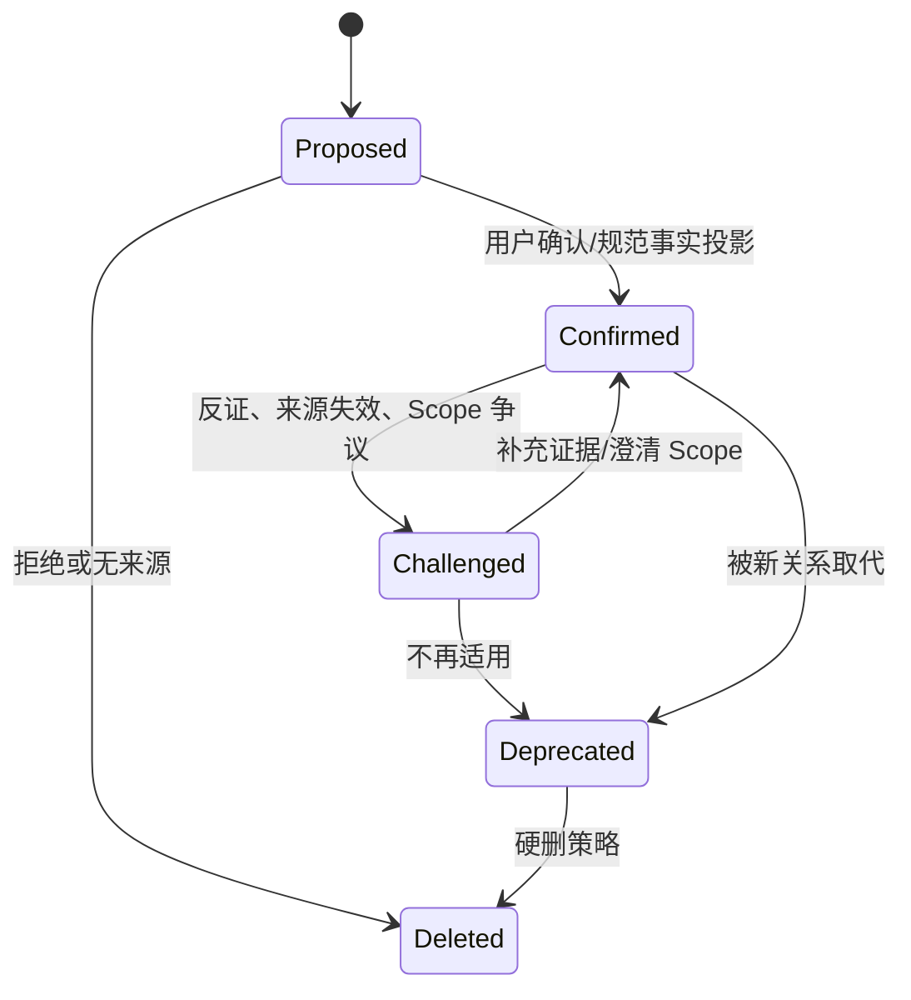

# DesignWan 知识图谱本体

文档状态：MVP 本地优先开发基线 v2.0  
存储约束：本地 SQLite 邻接表 + LocalVectorIndex；MVP 不使用远程图数据库

相关文档：[领域模型](./DOMAIN_MODEL.md) · [数据模型](./DATA_MODEL.md) · [个人记忆系统](./MEMORY_SYSTEM.md)

## 1. 图谱的职责

DesignWan 的知识图谱不是用节点连线表演“AI 很聪明”，而是回答设计项目中的可追溯关系问题：一个需求如何被解释、由谁提出、受什么约束、用哪些维度判断、被什么证据支持或挑战、影响了什么命题和决策、最终结果又如何修正经验。

图谱负责：

- 统一表达跨聚合关系和证据链；
- 为需求图、证据图、素材影响图、决策图和认知演化图提供局部查询；
- 为混合检索补充 1–3 跳关系候选；
- 保存 AI 推理候选的前提与规则版本；
- 识别关系冲突、作用域差异和认知演化。

图谱不负责：

- 取代 Project、Asset、Decision、Memory 等规范业务表；
- 绕过 Electron Main 的 Actor/Scope Policy 或 Memory Policy 写业务事实；
- 把全局蜘蛛网作为默认 UI；
- 无证据地自动得出“哪个设计更好”；
- 在 MVP 引入独立图数据库和跨系统一致性成本。

## 2. 存储模型与事实源

采用有属性的有向图：

```text
GraphNode(subject) -- GraphEdge(predicate) --> GraphNode(object)
GraphEdge -- supported/challenged by --> GraphEdgeEvidence
inferred GraphEdge -- derived from --> premise GraphEdges + InferenceRule version
```

规范实体节点通过 `canonical_entity_type + canonical_entity_id` 指向业务表。节点的 label/properties 是查询投影，可重建；实体名称、状态、权限仍以规范表为准。只有 Goal、Risk、Insight、Skill 等暂时没有独立规范聚合的图谱原生概念，才在 GraphNode 中保存本体校验后的属性。

`GraphEdge` 是关系断言的事实源，但不能用它反向修改规范聚合。例如确认 `Asset --influenced--> Decision` 可以追加 AssetUsage 和 GraphEdge；不能只写 Edge 就声称 Decision 已经记录。

MVP 用本地 SQLite 邻接表：

- 单跳/局部图：普通复合索引；
- 有界多跳：SQLite `WITH RECURSIVE`，最大深度 3，限制谓词与节点数；
- 语义候选：通过 LocalVectorIndex Seam 查询本机 Entity Embedding；
- 大规模离线统计：从领域事件构建物化视图；
- 不用 Neo4j 或云 Graph；只有本机规模与查询证据证明 SQLite 无法满足时才复审存储策略。

## 3. 节点本体

### 3.1 通用必填属性

每个 GraphNode 必须有：

| 属性 | 说明 |
|---|---|
| `id` | UUIDv7 |
| `workspace_id` | 一级租户隔离 |
| `node_type` | 版本化本体类型 |
| `label` | 可读名称；规范实体为投影 |
| `status` | active/deprecated/deleted |
| `owner_type`, `owner_id` | 所有权和团队预留 |
| `visibility` | private/project/client/workspace/restricted |
| `project_scope`, `client_scope`, `memory_scope` | 可空的作用域列 |
| `created_by`, `created_at`, `updated_at` | 审计元数据 |
| `ontology_version` | 本体版本 |

可选属性：`description`、`design_domain`、`valid_from/to`、`canonical_entity_type/id`、`properties jsonb`、`embedding_status`、`deleted_at`。

### 3.2 实体类型

| 类别 | Node Type | 规范来源/含义 | 关键可选属性 |
|---|---|---|---|
| 主体与组织 | `User` | 用户 | design_domains |
|  | `Workspace` | 租户 | workspace_type |
|  | `Client` | 甲方/委托方 | industry, sensitivity |
|  | `Stakeholder` | 决策人、反馈人、使用方 | role, influence_level |
| 工作上下文 | `Project` | 设计项目 | stage, design_domain |
|  | `DesignCase` | 项目内具体判断任务 | phase |
|  | `HistoricalWork` | 用户历史作品/设计版本 | work_type, result |
| 来源 | `Source` | 网页/平台/作者来源 | url, license_status |
|  | `SourceDocument` | 项目导入原件 | document_type, version |
| 需求 | `RequirementStatement` | 甲方/用户原句 | speaker, epistemic_type |
|  | `ExplicitRequirement` | 显性要求 | priority, status |
|  | `ImplicitNeed` | 隐性诉求候选 | confidence, status |
|  | `AmbiguousTerm` | 具体语境中的模糊词 | term_text |
|  | `Goal` | 商业目标或用户目标 | goal_type, metric_id |
|  | `Constraint` | 时间、品牌、技术、合规等约束 | constraint_type, hardness |
|  | `Risk` | 可验证风险 | severity, likelihood |
|  | `Hypothesis` | 待验证命题 | verification_method, status |
| 判断 | `JudgmentDimension` | 判断维度 | weight, domain |
|  | `JudgmentCriterion` | 维度下标准 | measurement_type |
|  | `Evidence` | 统一证据引用 | polarity, quality |
|  | `CounterEvidence` | 为查询方便区分的反向证据视图 | quality |
|  | `Method` | 设计/研究方法 | domain, maturity |
|  | `DesignStrategy` | 可复用策略模式 | conditions |
| 方案与决策 | `DesignProposition` | 候选设计命题 | status, validation_plan |
|  | `Alternative` | 决策备选 | disposition |
|  | `Tradeoff` | 得失与代价 | severity |
|  | `Decision` | 人类确认决策 | decided_at, status |
| 结果 | `Feedback` | 有原话和来源的反馈 | speaker, received_at |
|  | `Outcome` | 项目结果 | validation_status |
|  | `Metric` | 结果度量及口径 | unit, direction |
| 资产 | `Asset` | 完整素材 | asset_type, lifecycle_stage |
|  | `Fragment` | 可回父素材的局部 | fragment_type |
|  | `VisualFeature` | 抽象视觉特征 | design_domain |
|  | `InspirationBoard` | 正/反/边界案例板 | board_type |
| 认知 | `Insight` | 有证据的洞察 | epistemic_type |
|  | `MemoryCandidate` | 待审候选 | requires_confirmation |
|  | `Memory` | 可召回记忆 | memory_type, confidence |
|  | `Skill` | 用户可解释的能力/方法熟练度候选 | level, status |
|  | `DictionaryTerm` | 个性化词典词条 | language, domain |
|  | `DictionarySense` | 词条在某 Scope 的含义 | scope_type, valid_time |

说明：`CounterEvidence` 可以是 `Evidence` 的带 `polarity=challenge` 视图，物理上无需重复表；`Skill` 涉及用户能力判断时必须经 Memory Policy 和用户确认。

## 4. 关系本体与方向

所有谓词使用小写 snake_case，方向固定。查询层可以展示反向文案，但不为普通逆关系复制第二条 Edge。`visually_similar_to` 等对称关系使用规范化 Node ID 排序存一条。

### 4.1 结构与归属关系

| Subject | Predicate → | Object | 说明 |
|---|---|---|---|
| Workspace | `contains` | Client/Project/Asset/Memory | 查询投影，不代替外键 |
| Client | `commissions` | Project | 项目属于哪个 Client |
| Project | `contains` | DesignCase/SourceDocument | 项目结构 |
| DesignCase | `uses` | JudgmentDimension/Method/Board | 当前判断上下文 |
| Fragment | `cropped_from` | Asset | 不可反向 |
| Asset | `sourced_from` | Source | 来源 |
| RequirementStatement | `quoted_from` | SourceDocument | 原句定位 |
| DictionaryTerm | `has_sense` | DictionarySense | 多义结构 |

### 4.2 需求关系

| Subject | Predicate → | Object | 是否证据必填 |
|---|---|---|---:|
| RequirementStatement | `expresses` | ExplicitRequirement/Goal/Constraint | 是，原句自身 |
| RequirementStatement | `implies` | ImplicitNeed/Risk/Hypothesis | 是；默认 proposed |
| Requirement/Interpretation | `contradicts` | Requirement/Interpretation | 是；对称规范化 |
| RequirementStatement | `clarifies` | AmbiguousTerm/Requirement | 是 |
| Requirement/Goal | `depends_on` | Requirement/Goal/Constraint | 是 |
| RequirementStatement | `requested_by` | Stakeholder | 是 |
| AmbiguousTerm | `interpreted_as` | DictionarySense/ExplicitRequirement | 是；按 Scope |
| Hypothesis | `assumed_from` | Statement/Evidence/Memory | 是 |

### 4.3 判断关系

| Subject | Predicate → | Object | 语义 |
|---|---|---|---|
| Proposition/Alternative | `evaluated_by` | JudgmentDimension/Criterion | 用何维度比较 |
| Proposition/Dimension/Hypothesis | `supported_by` | Evidence/Asset/Memory/Outcome | 支持但不等于证明 |
| Proposition/Dimension/Hypothesis/Memory | `challenged_by` | CounterEvidence/Feedback/Outcome | 反证或质疑 |
| Proposition | `constrained_by` | Constraint | 硬/软约束 |
| Proposition/Alternative | `prioritized_over` | Proposition/Alternative | 必须绑定 Decision/理由 |
| Evidence | `derived_from` | Source/Asset/Document/Outcome | 证据来源链 |
| JudgmentCriterion | `operationalizes` | JudgmentDimension | 把维度变成可判断标准 |

### 4.4 方案与决策关系

| Subject | Predicate → | Object | 说明 |
|---|---|---|---|
| DesignProposition | `addresses` | Requirement/Goal/Risk | 命题处理什么 |
| DesignProposition | `sacrifices` | Goal/Dimension/Constraint | 接受的代价 |
| DesignProposition | `enables` | Goal/Outcome/Strategy | 可能带来的能力 |
| DesignProposition | `risks` | Risk/Outcome | 风险不是已发生结果 |
| Alternative | `substitutes` | Alternative/Proposition | 替代关系 |
| Proposition/Alternative | `rejected_for` | Feedback/Evidence/Constraint/Tradeoff | 被否决依据 |
| Decision | `selects` | Proposition/Alternative | 人类确认选择 |
| Decision | `rejects` | Proposition/Alternative | 明确放弃 |
| Decision | `selected_because` | Evidence/Goal/Constraint | 必须有真实证据 |
| Decision | `accepts` | Tradeoff | 接受什么代价 |
| Decision | `supersedes` | Decision | 决策演化 |

### 4.5 素材关系

| Subject | Predicate → | Object | 说明 |
|---|---|---|---|
| Asset/Fragment | `exemplifies` | VisualFeature/DictionarySense/Strategy | 实例化，不表示好坏 |
| Asset/Fragment | `visually_similar_to` | Asset/Fragment | 对称；相似不等于重复 |
| Asset/Fragment/HistoricalWork | `inspires` | Proposition/Alternative | 用户确认影响链 |
| Asset/Fragment | `contradicts` | Proposition/Requirement/Sense | 反例/边界案例 |
| Asset/Fragment | `used_in` | Project/DesignCase/Board | 使用事实 |
| Asset/Fragment/Method | `influenced` | Proposition/Decision/HistoricalWork | 需要用户确认或行为证据 |
| Asset | `duplicates` | Asset | 精确/近似重复候选；不自动合并 |

### 4.6 经验、记忆与结果关系

| Subject | Predicate → | Object | 说明 |
|---|---|---|---|
| Insight/Memory | `learned_from` | Project/Decision/Feedback/Outcome | 经验来源 |
| Memory/Method/Proposition | `validated_by` | Outcome/Metric/Evidence | 仅在 Scope 内支持 |
| Memory/Method/Proposition | `invalidated_by` | Outcome/Metric/CounterEvidence | 触发 challenged，不自动删除 |
| Insight/Memory | `refined_from` | Insight/Memory | 保留演化 |
| Method/Memory/Strategy | `applicable_when` | Goal/Constraint/Domain/Sense | 条件化适用 |
| Method/Memory/Strategy | `not_applicable_when` | Goal/Constraint/Domain/Sense | 反向适用条件 |
| Memory | `conflicts_with` | Memory | 对称；指向 MemoryConflict 记录 |
| Memory | `supersedes` | Memory | 时间演化，不等于硬删旧记忆 |
| DictionarySense | `supported_by` | Asset/Fragment/Statement/Memory | 语义证据 |
| Feedback | `evaluates` | Proposition/Decision/HistoricalWork | 反馈对象 |
| Outcome | `measured_by` | Metric | 结果口径 |

## 5. Edge 属性、证据与状态

### 5.1 Edge 必填属性

```text
id, workspace_id
subject_node_id, predicate, object_node_id
edge_origin          asserted | user_confirmed | ai_proposed | inferred
status               proposed | confirmed | challenged | deprecated | deleted
confidence, confidence_method
visibility, memory_scope, project_scope, client_scope
created_by, created_reason, created_at, updated_at
valid_from, valid_to
ontology_version
```

可选属性：`ai_run_id`、`confirmed_by/at`、`challenge_reason`、`properties jsonb`、`supersedes_edge_id`、`deleted_at`。

### 5.2 证据绑定

每个需要证据的 Edge 通过 `GraphEdgeEvidence` 绑定一条或多条规范来源：

```text
edge_id
evidence_type         source_chunk | asset | fragment | decision | feedback |
                      outcome | activity_event | memory | external_source
evidence_id
polarity              support | counter | neutral
weight                 0..1
source_locator         page/bbox/time range/quote offsets
observed_at
```

规则：

- 证据访问权限必须不宽于 Edge，召回时还要重新检查源对象权限。
- 原文证据保存 locator + hash，不能只存 AI 摘要。
- AI Run 不是事实证据，只是“谁生成了这条候选”的 Provenance。
- 单一来源的多个派生片段不能冒充多个独立证据。
- 来源删除后 Edge 进入 `challenged` 或降级；不能保留泄漏正文的 properties。

### 5.3 置信度

Edge 置信度表示当前 Scope 下关系断言的可用程度：

- 用户明确确认/规范外键投影：高先验；
- 有来源的项目事实：中高先验；
- 行为推断：中低先验；
- AI 单次推断：低先验且 `proposed`；
- 推理 Edge：不高于最弱前提，并扣除规则误差；
- 反证、过期、来源失效、Scope 不匹配：降权。

模型 token probability 不直接写入 `confidence`。分数算法与校准数据集使用 `confidence_method`/策略版本记录。

### 5.4 状态机



推理关系从 `Proposed` 开始。即使前提都是 Confirmed，也只有低风险结构投影可自动 Confirmed；影响推荐、记忆或决策的推理仍需领域 Policy/用户确认。

## 6. 作用域机制

### 6.1 Scope 规则

Edge Scope 不能比其任一端节点和任一 Evidence 更宽：

```text
effective_edge_scope = intersection(
  subject_scope,
  object_scope,
  evidence_scopes,
  workspace/client/project policies,
  actor_permissions
)
```

- Project Edge 默认只在该 Project 可见。
- Client Edge 只能在同 Client 且项目允许跨项目召回时使用。
- Personal Edge 不得引用 Restricted Client 的原始内容；迁移时需生成去客户化候选并确认。
- Team Edge 与 Personal Edge 并列，不能覆盖。
- General Knowledge 必须标注许可和外部来源，不能伪装成用户经验。

### 6.2 查询顺序

Graph Module 在构造 SQLite 查询前，由 Electron Main 恢复并验证 Actor/Workspace/Project Scope；Scope 条件必须进入候选查询和递归 CTE。禁止先遍历全 Workspace 再在 Renderer 删节点，这不仅泄漏数据，也会让路径得分被不可见节点污染。

## 7. 关系冲突

### 7.1 冲突来源

1. 相同 Subject + Predicate + Scope 出现互斥 Object。
2. 谓词冲突组：`supported_by/challenged_by`、`applicable_when/not_applicable_when`、`selects/rejects`、`validated_by/invalidated_by`。
3. 同一 DictionaryTerm/Scope 的 DictionarySense 互斥。
4. 新 Edge 与旧 Edge 方向或类型不符合本体。
5. 同一关系在不同时间有效，旧关系未结束。
6. Evidence 本身被删除、挑战或改判。

### 7.2 不应误报的情况

- Personal 偏好与 Client 要求不同；
- 品牌设计与 UI 数据后台的适用条件不同；
- 旧观点与新观点有明确有效期；
- 支持与反证同时存在但尚无结论；
- 两个 Stakeholder 提出不同意见。

这些应作为 Scope/时间/观点差异展示，而不是自动判定数据库矛盾。

### 7.3 解决

`scope_split | time_split | keep_both | supersede | deprecate | merge | dismiss`。解决关系产生 `EdgeConflict` 记录并保留证据。`selects/rejects` 的冲突只能由 Decision 修订解决；Memory 相关冲突必须经过 Memory Policy。

## 8. 推理规则

推理以“生成可解释候选”为默认，不做开放世界的无限传递闭包。每条派生 Edge 保存 `rule_key`、`rule_version` 和全部 premise Edge ID。

### 8.1 允许的 MVP 规则

| Rule | 前提 | 候选结论 | 防护 |
|---|---|---|---|
| R1 局部继承使用上下文 | Fragment `cropped_from` Asset；Fragment `used_in` Project | Asset `used_in` Project | 结构事实，可自动投影；不反推该 Asset 影响决策 |
| R2 视觉特征召回 | Asset `exemplifies` Feature；Feature `applicable_when` Goal | Asset `supports` Goal 的 Evidence 候选 | 必须显示两跳理由；不自动成为决策证据 |
| R3 模糊词语义候选 | Term `has_sense` Sense；Statement 包含 Term；Scope 匹配 | Term occurrence `interpreted_as` Sense | Project > Client > Personal；需要用户确认 |
| R4 命题证据链 | Asset `inspires` Proposition；Proposition `addresses` Requirement | Asset 作为 Requirement 相关候选 | 仅用于召回，不声称 Requirement 被满足 |
| R5 决策影响 | Decision `selects` Proposition；Asset `influenced` Proposition | Asset `influenced` Decision 候选 | 需用户确认实际影响 |
| R6 经验提取 | Decision `selects` Proposition；Decision `validated_by` Outcome；Evidence 充分 | MemoryCandidate `learned_from` Project | 只能到 Candidate，经 Memory Policy |
| R7 结果反证 | Memory/Method `applicable_when` Condition；Outcome `invalidated_by` Metric | Memory `challenged_by` Outcome | 只标记 challenged，不自动废弃 |
| R8 Scope 冲突拆分 | 相反 Edge 位于不同 Client/Domain | `scope_split` 建议 | 不合并、不扩大范围 |
| R9 决策演化 | NewDecision `supersedes` OldDecision | OldDecision status=Superseded 投影 | 规范 Decision 先完成领域写入 |
| R10 来源失效传播 | Source deleted/unreachable；Edge 只有该 Source 证据 | Edge `challenged` | 不删除历史事实；召回显示来源失效 |

### 8.2 禁止的推理

- `A visually_similar_to B` 且 `B used_in Project` ⇒ `A 适合 Project`；相似不等于适用。
- “用户收藏很多 X” ⇒ “用户喜欢 X”；收藏是行为，不是偏好授权。
- “某方法一次成功” ⇒ “用户长期擅长该方法”。
- “Client 喜欢 X” ⇒ “用户个人喜欢 X”。
- “命题被选择” ⇒ “命题结果成功”。
- 没有 Metric/Outcome 的情况下，把客户反馈“不错”推理成 validated。
- 无深度限制的 `depends_on`、`influenced`、`learned_from` 传递闭包。

## 9. 查询 Interface 与执行策略

Knowledge Graph 模块只暴露少量 Interface：

```ts
interface KnowledgeGraphModule {
  assert(statement: GraphStatement): Promise<AssertionResult>;
  challenge(edgeId: Id, evidence: EvidenceRef): Promise<ChallengeResult>;
  neighborhood(query: NeighborhoodQuery): Promise<GraphView>;
  paths(query: BoundedPathQuery): Promise<GraphPathResult>;
}
```

`NeighborhoodQuery` 必带 Actor、Workspace、Scope、根节点、允许谓词、最大深度、最大节点数和证据要求。最大深度默认 2、上限 3；返回局部图 + 路径解释，不返回无边界的所有节点。

### 9.1 SQLite 有界路径策略

```sql
with recursive visible_edges as (
  select e.*
  from graph_edges e
  where e.workspace_id = :workspace_id
    and e.deleted_at is null
    and e.status in ('confirmed', 'challenged')
    and e.predicate in (:allowed_predicates)
    and e.project_scope in (:allowed_project_scopes)
), walk as (
  select
    e.subject_node_id as root_id,
    e.object_node_id as node_id,
    json_array(e.id) as edge_path,
    json_array(e.subject_node_id, e.object_node_id) as node_path,
    1 as depth
  from visible_edges e
  where e.subject_node_id = :root_node_id

  union all

  select
    w.root_id,
    e.object_node_id,
    json_insert(w.edge_path, '$[#]', e.id),
    json_insert(w.node_path, '$[#]', e.object_node_id),
    w.depth + 1
  from walk w
  join visible_edges e on e.subject_node_id = w.node_id
  where w.depth < min(:max_depth, 3)
    and not exists (
      select 1 from json_each(w.node_path) where value = e.object_node_id
    )
)
select * from walk
order by depth, node_id
limit :max_paths;
```

示例只表达查询形状，M0 必须用 SQLite 实际版本验证 JSON1/递归 CTE、索引计划和上限。Actor/Scope 由 Main 解析成不可放宽的参数，不接受 Renderer 自报权限。生产查询必须限定 Workspace、Project/Client、状态、谓词、深度、环和结果数。

## 10. 真实设计项目查询示例

每个查询先过 Main/Module Scope Policy，再返回来源和 Why Recalled。以下 14 个均可映射为 SQLite 1–3 跳局部查询。

### Q1：年轻感但不靠高饱和

**问题**：找出我过去收藏的、能表达年轻感但不依赖高饱和色彩的品牌案例。

```text
Asset/Fragment --exemplifies--> DictionarySense(年轻感)
Asset/Fragment --exemplifies--> VisualFeature
排除 VisualFeature(高饱和)
限制 design_domain=brand，优先曾 --used_in/influenced--> Project/Decision
```

返回 Asset、局部、为何命中、使用历史和来源；不能把“低饱和”自动等价成“年轻”。

### Q2：同一客户对“高级”的真实语义

**问题**：Client A 过去说“高级”时，最终确认过哪些具体含义？有哪些正例和反例？

```text
DictionaryTerm(高级) --has_sense--> DictionarySense(client_scope=A)
Sense <--interpreted_as-- AmbiguousTerm <--clarifies/expresses-- RequirementStatement
Asset/Fragment --exemplifies/contradicts--> Sense
Sense --validated_by/challenged_by--> Feedback/Outcome
```

### Q3：甲方需求中的未解决矛盾

**问题**：这个项目里“保持品牌克制”和“首屏要有强促销冲击”之间有哪些已确认冲突与待验证假设？

```text
Requirement/Goal --contradicts--> Requirement/Goal
Hypothesis --assumed_from--> RequirementStatement
仅 status=confirmed/proposed 且 project_scope=当前项目
```

返回双方原句、Stakeholder、证据和解决状态。

### Q4：某判断维度的历史依据

**问题**：为什么本项目把“可信度”放在“视觉冲击”之前？

```text
Proposition --evaluated_by--> Dimension(可信度/视觉冲击)
Dimension <--supported_by/challenged_by-- Evidence/Outcome/Memory
Decision --selected_because--> Evidence/Goal/Constraint
```

只显示真实 Decision/Evidence 链，不让 LLM 临时编理由。

### Q5：被否决方向及否决原因

**问题**：过去医疗品牌项目中，哪些极简方向被否决？是客户主观不喜欢，还是可用性/合规结果失败？

```text
Proposition --rejected_for--> Feedback/Evidence/Constraint/Tradeoff
Feedback --evaluates--> Proposition
Outcome --measured_by--> Metric
限制 Client/Domain Scope，区分 opinion 与 validated outcome
```

### Q6：素材如何影响最终作品

**问题**：这张参考图到底影响了哪个命题、决策和最终作品？

```text
Asset --inspires/influenced--> Proposition
Decision --selects--> Proposition
Asset --influenced--> Decision/HistoricalWork
Outcome --measured_by--> Metric
```

返回用户确认的影响链；只有 `used_in` 不能声称“影响”。

### Q7：过去有效的方法及适用边界

**问题**：在 B2B SaaS 导航重构中，过去哪些方法有效，又在什么条件下失效？

```text
Method --applicable_when/not_applicable_when--> Goal/Constraint/Domain
Method --validated_by/invalidated_by--> Outcome/Metric
Method --used_in--> DesignCase
```

### Q8：反向案例召回

**问题**：给当前“高信息密度仪表盘”命题找 3 个反例，特别是因层级混乱导致任务效率下降的历史案例。

```text
Proposition --risks--> Risk(层级混乱)
CounterEvidence/Asset --contradicts/challenged_by--> Proposition/Dimension
HistoricalWork/Outcome --invalidated_by--> Metric(任务效率)
```

结果必须包含反例为何相关，不只返回视觉相似图。

### Q9：观点演化

**问题**：我对“用色彩建立信息层级”的判断这两年如何变化？

```text
Memory(new) --refined_from/supersedes--> Memory(old)
Memory --learned_from--> Project/Outcome
按 valid_from 排序，显示支持与反证
```

### Q10：跨项目迁移但不泄漏客户

**问题**：从过去项目提炼可用于当前项目的“价格感”经验，但排除其他 Client 的原始资料。

```text
只召回 personal_scope、已去客户化并 confirmed 的 Memory/Insight
Memory --learned_from--> Project 仅用于可访问来源解释
禁止 client_scope != 当前 Client 的节点和证据进入候选
```

### Q11：设计命题覆盖了什么、牺牲了什么

**问题**：命题“编辑式留白 + 强产品摄影”覆盖哪些需求，牺牲哪些业务目标，还有哪些硬约束未处理？

```text
Proposition --addresses--> Requirement/Goal
Proposition --sacrifices--> Goal/Dimension
Proposition --constrained_by--> Constraint
差集：当前确认的 hard Constraint - 已连接/有验证计划的 Constraint
```

### Q12：决策解释生成证据包

**问题**：为甲方生成这个方向的说明，哪些事实和证据可以用，哪些只是内部假设不能写成结论？

```text
Decision --selected_because--> Evidence/Goal/Constraint
Evidence --derived_from--> Source/Asset/Outcome
Hypothesis --assumed_from--> Evidence
按 epistemic_type 分组，剔除 restricted/internal-only
```

图谱只提供证据包；解释生成模块负责面向对象改写，但不得补造关系。

### Q13：素材价值生命周期

**问题**：哪些素材不是“囤积”，而是真的进入项目、参与判断并形成了经验？

```text
Asset --used_in--> Project/Board
Asset --inspires/influenced--> Proposition/Decision/HistoricalWork
Memory --learned_from--> Decision/Project 且 Evidence 回指 Asset
```

返回生命周期阶段，不生成单一审美分。

### Q14：路径依赖提醒

**问题**：最近 5 个品牌项目是否都沿用了相同视觉特征和方法？有哪些有证据的邻近路径可挑战它？

```text
Project <-used_in- Asset --exemplifies--> VisualFeature
Project <-used_in- Method
统计重复路径；再取相邻 Feature/Method 的反例与 validated Outcome
排除无证据的纯相似扩散
```

## 11. 局部图 View Model

前端不直接消费数据库 Edge。Graph Module 返回面向任务的局部 View：

```text
view_type             requirement_map | evidence_map | influence_map |
                      decision_map | cognition_timeline
root_nodes[]
nodes[]               id, type, label, epistemic/status/scope badges
edges[]               predicate, direction, status, confidence band
paths[]               ordered edge ids + why this path matters
evidence_summaries[]  source type, locator, access status
conflicts[]           conflict type + resolution state
truncation            depth, omitted counts, continuation cursor
```

UI 默认只展开与当前任务相关的 1 跳；用户主动展开才查下一跳。颜色不承担唯一语义，状态和认知类型同时用文字/图形标识。

## 12. 本体版本与演进

- `node_type_registry`、`edge_type_registry` 和推理规则都有 `ontology_version`。
- 新增类型向后兼容；重命名用 alias/deprecated，不原地改历史谓词。
- 关系语义改变时创建新 predicate + 回填推理投影，旧 Edge 保留版本。
- 推理规则升级仅重建 `inferred` Edge，不改用户确认 Edge。
- 每次本体升级运行：类型合法性、方向、Scope、Evidence、冲突、查询结果和删除泄漏回归测试。

## 13. 质量与安全验收

| 维度 | 验收 |
|---|---|
| 方向正确 | Gold Edge 集中 Subject/Predicate/Object 准确率达发布阈值 |
| Evidence | 需证据关系的 Provenance 完整；无证据 AI Edge 不得 Confirmed |
| Epistemic | Statement、Opinion、Inference、Hypothesis、Conclusion 不混淆 |
| Scope | 跨 Workspace/Client/Restricted Project 路径泄漏为 0 |
| 冲突 | 能区分真正矛盾与 Scope/时间差异 |
| 推理 | 每条 inferred Edge 可回到规则版本和全部前提 |
| 删除 | T0 Tombstone 同事务使源实体/Memory 的图节点、边、局部图缓存和搜索结果不可查询；T+8 Purge 幂等删除派生图；T+30 在线证书 Graph 剩余命中为 0 |
| 性能 | 常用 1–2 跳局部图有查询基线；最大深度/节点数强制限制 |
| 产品价值 | 查询能解释判断和决策，不只返回“相关节点” |

## 14. MVP 范围与演进触发器

MVP 只实现：

- 核心 Node/Edge Registry；
- 规范实体节点投影；
- 需求、判断、素材、决策、结果、记忆的核心关系；
- Edge Evidence、Scope、状态、置信度；
- 1–2 跳局部图和上述关键查询的子集；
- 少量确定性推理候选；
- Graph 与 Memory/删除联动。

删除联动以本地业务事实源的 Tombstone 为准，而不是等待 Graph Worker：所有 Graph Query 必须 Join/校验源对象 active 状态，T0 后即使派生 Edge 尚未物理清除也不得返回。`deletion.local_purge` 在 App 运行且到达 T+8 后删除节点投影、边、Evidence、推理 Trace 与局部图缓存；证书只记录类别/计数与检查版本。设备离线、Extension 不可达、OS/iCloud/Time Machine 快照及 Provider 留存不在 Graph 在线证明范围内，必须列为 Pending/Exclusion。

暂不实现：全局蜘蛛网、开放式本体编辑、无限深度遍历、复杂图算法、自动本体学习、Neo4j/云 Graph、跨 Workspace 通用图合并。

只有同时出现以下证据才评估独立本地图数据库或新 Adapter：核心查询稳定需要 4+ 跳；本机数据规模使受限递归 CTE 无法达标；Graph 写入/重建成为 SQLite 明确瓶颈；方案仍满足业务内容不出设备。否则换数据库只是给架构穿亮片西装，热闹但不产生用户价值。
