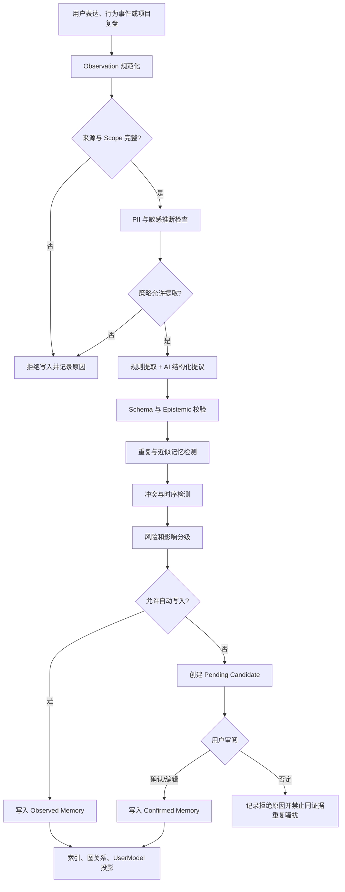
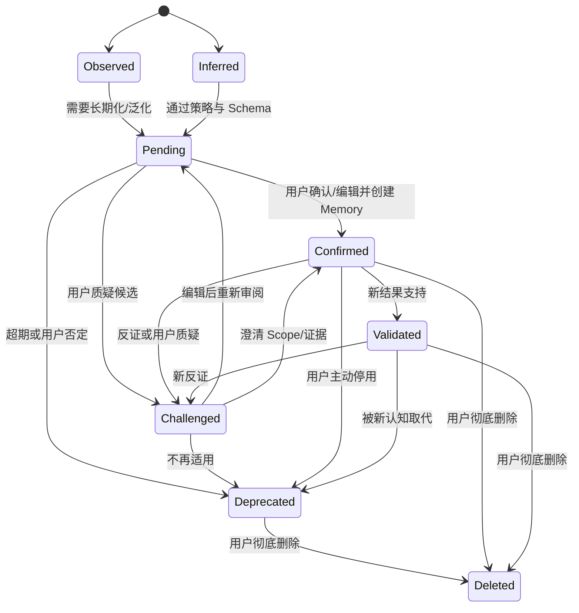
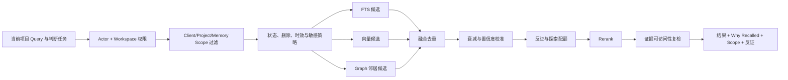
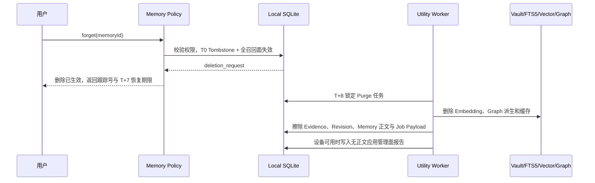

# DesignWan 个人记忆系统架构

文档状态：MVP 本地优先开发基线 v2.0  
核心原则：可见、可解释、可确认、可修正、可隔离、可遗忘

相关文档：[领域模型](./DOMAIN_MODEL.md) · [数据模型](./DATA_MODEL.md) · [知识图谱本体](./KNOWLEDGE_GRAPH.md)

## 1. 目标与非目标

个人记忆系统的目标不是制造一个“越来越像用户”的黑箱人格，而是把来源明确的设计经验转成在正确情境下可再次调用、可被挑战的认知记录。

系统必须回答六个问题：

1. 这条记忆从哪里来？
2. 它是事实、用户判断还是 AI 推断？
3. 它在哪个 Project、Client、领域和时间段适用？
4. 谁确认过，当前置信度为何是这个值？
5. 有什么反向证据或冲突记忆？
6. 用户如何修改、停用或彻底删除它？

非目标：

- 不推断人格、心理、身份、健康或其他敏感画像。
- 不把点击/收藏次数直接解释为长期审美偏好。
- 不让 AI 直接写入长期 Memory。
- 不用新记忆覆盖旧记忆，掩盖用户认知演化。
- 不让个性化变成只推荐用户已经喜欢的同类素材。
- 不以“模型需要学习”为由阻碍用户删除。
- 不把 Memory、Evidence、Embedding、原始 Prompt/输出写入云控制面；所有规范记忆默认只在设备。

## 2. 记忆分类

| 类型 | 典型内容 | 默认 Scope | 默认确认 | 默认衰减 |
|---|---|---|---|---|
| 稳定偏好 `stable_preference` | 明确喜欢/厌恶、设计原则、沟通偏好 | personal；可更窄 | 必须确认 | 慢；仍需周期复核 |
| 行为习惯 `behavior_habit` | 常用视图、收藏/搜索/分组方式 | personal | 原子事实可自动；归纳必须确认 | 中 |
| 项目情景 `project_episode` | 项目背景、需求、方向、反馈、结果 | project/client | 事实可自动；可迁移结论需确认 | 项目事实不衰减，召回权重衰减 |
| 方法 `method` | 常用方法、有效/失效条件 | personal/client/project | 重要归纳必须确认 | 中慢，受结果校准 |
| 判断与决策 `judgment_decision` | 依据、选择、放弃、代价、结果 | project；确认迁移后 personal | 决策事实自动，迁移结论确认 | 慢 |
| 失败与反例 `failure_counterexample` | 被否决方向、返工原因、无效方法 | project/client/personal | 必须确认归因 | 慢；反例不能被轻易淡出 |
| 能力成长 `capability_growth` | 新认知、熟练度变化、经验缺口 | personal/domain | 必须确认 | 中；定期复核 |
| 当前工作 `working` | 当前讨论位置、临时假设、未决问题 | session/project | 可自动 | 快；会话/项目结束归档或过期 |

“项目中发生了某事”与“这说明用户长期如何”是两条不同记录。前者可以是自动写入的情景事实，后者只能先成为 Memory Candidate。

## 3. 记忆数据结构

每条 Memory 至少包含：

```text
identity       id, workspace_id, owner_type, owner_id
content        statement, structured_payload, memory_type
epistemics     epistemic_type, confidence, confidence_method
scope          memory_scope, project_scope, client_scope, design_domain
provenance     supporting_evidence[], counter_evidence[], source_candidate_id
governance     user_confirmed, allow_auto_recall, sensitivity, visibility
time           first_observed_at, valid_from, valid_to, last_validated_at
decay          decay_policy, base_weight, current_decay_weight
lifecycle      status, version, supersedes_id, challenged_at, deleted_at
```

Statement 应是可判断命题，例如“在品牌重塑项目中，凯哥通常先确认品牌可信度边界，再讨论视觉冲击”，而不是空泛标签“用户重视策略”。结构化 payload 保存条件、对象、例外、结果等；Statement 与 payload 修改都创建 Revision。

## 4. 唯一写入口：Memory Policy

`MemoryPolicyModule` 是所有记忆写入与召回的唯一外部 Seam。Renderer、Extension、Utility Worker、AI、复盘模块和图谱模块都不能直接写本地 `memory_memories`。

概念 Interface：

```ts
interface MemoryPolicyModule {
  propose(input: MemoryObservation): Promise<ProposalResult>;
  review(command: ReviewMemoryCandidate): Promise<ReviewResult>;
  recall(query: MemoryRecallQuery): Promise<MemoryRecallResult>;
  challenge(command: ChallengeMemory): Promise<ConflictResult>;
  forget(command: ForgetMemory): Promise<DeletionReceipt>;
}
```

Interface 隐藏：去重、合并、冲突、衰减、权限、Client 隔离、反回音壁、Embedding、图谱扩展和删除编排。LocalStore、LocalVectorIndex、Embedding Model、Clock 都是实现内部 Seam；SQLite/Exact/候选向量生产 Adapter 与测试 Adapter 都通过同一 Interface。

## 5. 写入管线



任何 AI 输出只能到 `MemoryCandidate` 或项目复盘草稿。即使置信度为 0.99，也不能跨过确认策略；模型自信不是用户授权。

### 5.1 Observation 规范化

输入源分为：

- 明确用户表达：用户直接说“我不喜欢……”“以后提醒我……”。
- 可验证行为事实：打开、收藏、加入 Board、采纳/拒绝、项目中使用。
- 项目规范事实：Decision、Feedback、Outcome、ProjectReview。
- 导入内容：历史复盘、方法论笔记、旧项目文档。
- AI 派生：需求解构、视觉分析、模式归纳；只能作为弱证据和候选。

每个 Observation 必带 `workspace_id`、Actor、来源对象、时间、Scope、Epistemic Label 和可访问的 ProvenanceRef。缺任一关键项就不进入候选。

### 5.2 自动写入与必须确认矩阵

| 内容 | 可以自动记录？ | 可以自动成为长期 Memory？ | 处理 |
|---|---:|---:|---|
| 用户在某时把 Asset 加入某 Project/Board | 是 | 否 | 写 Activity/项目事实；多次行为仅形成候选 |
| 用户打开、搜索、切换视图 | 是 | 否 | 行为事实，按保留期聚合 |
| 用户明确记录的 Decision、选择/放弃和代价 | 是 | 仅 Project Scope | 记录情景/决策事实；跨项目规律待确认 |
| Project、Client、Outcome 的规范字段 | 是 | 仅对应 Scope | 可自动建立情景记忆投影，不得泛化 |
| 当前会话位置、临时假设、未决问题 | 是 | 否 | Working Memory；会话结束快速过期 |
| “用户经常使用 Grid 视图” | 原始次数可自动 | 条件允许 | 达样本阈值后可写 Observed Habit，必须显示统计来源，可一键关闭 |
| 用户明确说“我不喜欢无意义渐变” | 作为表达事实可自动 | 否 | 创建高优先级 Candidate，用户确认 Scope 和允许召回 |
| 长期审美偏好/厌恶项 | 否 | 否 | 必须确认 |
| 常用设计原则、长期判断顺序 | 否 | 否 | 必须确认 |
| 方法有效/失效的因果结论 | 否 | 否 | 必须确认，并绑定 Outcome/反证 |
| 用户能力强项、短板或成长判断 | 否 | 否 | 必须确认；不得使用贬损或人格化标签 |
| 用户思维类型、人格、身份/敏感属性 | 否 | 否 | 默认禁止提取与保存 |
| Client 对“高级”的含义 | 甲方原话可自动记录 | 否 | Client/Project Scope Candidate，用户确认语义 |
| 冷启动导入产生的偏好/方法推断 | 否 | 否 | 批量 Candidate，分组审阅，不静默写入 |
| 项目复盘中的可迁移经验 | 否 | 否 | 复盘先确认，再生成 Candidate，再确认 Scope |
| AI 推断的任何长期认知 | 否 | 否 | 永远不能直接写长期 Memory |

自动写入的 Observed 行为记忆也必须可见、可关闭、可删除，并且默认召回影响低于 Confirmed/Validated Memory。

### 5.3 候选审阅

候选界面必须同时展示：

- 建议记住什么；
- 来源和支持/反向证据；
- AI 做了什么推断；
- 建议的 Scope、Client、设计领域和有效期；
- 会影响哪些未来召回/推荐；
- `确认`、`编辑后确认`、`缩小范围`、`暂不处理`、`否定`。

用户拒绝后记录候选 fingerprint 与拒绝原因。同一证据、同一命题不得反复生成；只有出现实质新证据或用户主动恢复才可重新提议。

### 5.4 冷启动导入控制

冷启动导入固定为每批最多 500 个文件、每 Workspace 同时最多 1 批 active + 1 批 queued、每 UTC 自然日最多接收 2,000 个文件。Import Module 在数据库事务内锁定 Workspace 导入创建路径与 UTC 日计数器；Batch 的 active/queued 部分唯一约束负责槽位一致性。超出单批返回 `422`，第三批或日限额返回带稳定原因和 `retry_after` 的 `429`。预检不是授权，不能用应用内计数承受并发。

Import Item 以 `(workspace_id, batch_id, client_file_id)` 幂等；重试不重复扣接收配额、不重复生成 Observation/Candidate。取消批次不返还 UTC 日接收量，避免反复取消绕过。导入只生成带 Provenance 的 Observation 和分组 Candidate；即使文件量大或 AI 置信度高，也不能静默升级长期 Memory。导入触发的 AI Run 正常进入用户月度预算，Hard Cap 后文件仍可保存/手工整理，AI 提取任务暂停或确定性降级。

## 6. 生命周期与状态机

候选和生效记忆分离，避免一个万能状态机混淆“尚未授权”和“已授权但被挑战”。



规则：

- `Validated` 只表示在定义 Scope 和证据下得到结果支持，不是永恒真理。
- `Challenged` 默认降权并与冲突/反证一起展示，不能静默隐藏。
- `Deprecated` 保留认知演化和历史项目解释，但默认不参与主动召回。
- `Deleted` 立即不可召回；硬删完成后只保留无正文的 Deletion Receipt。
- Candidate 和正式 Memory 在物理表中分离，但产品只展示上述统一状态；`accepted/rejected` 仅作为审阅动作，不形成第二套生命周期。

## 7. 去重、合并与版本

### 7.1 三层重复检测

1. **精确**：归一化 Statement hash + 相同 Scope/类型。
2. **语义**：同 Workspace/Scope 内 Embedding 近邻；阈值由 Eval 校准，不能凭经验写死。
3. **结构**：主体、谓词、对象、条件、设计领域和有效期相似。

命中相似只产生处理建议：

- `reinforce`：新证据支持同一记忆，追加 Evidence 并重新校准。
- `revise`：意思有实质变化，创建 Revision 或新 Memory 并 `supersedes`。
- `scope_split`：个人偏好与特定 Client 语义其实不同，保留两条。
- `keep_both`：表面相似但条件不同。

禁止“向量相似度高就自动合并”。合并必须保留所有 Provenance、反证、旧版本和用户确认历史。

### 7.2 合并条件

只有同时满足以下条件才可自动追加为支持证据：同一 Workspace、兼容 Scope、同一认知类型、无实质反向关系、来源可访问、记忆未删除。Statement 或 Scope 变化仍需用户确认。

## 8. 冲突检测与解决

### 8.1 冲突类型

| 类型 | 示例 | 默认处理 |
|---|---|---|
| 直接矛盾 | “偏好克制留白” vs “偏好信息密集” | 标记 open，展示证据，等待用户判断 |
| 时序变化 | 2024 年偏好 A，2026 年改为 B | 保留两条有效期；新记录可 supersede 旧记录 |
| Scope 差异 | 个人偏好 A，但 Client X 要求 B | 不视为错误；拆 Scope 并在召回时解释 |
| 条件差异 | 品牌项目用 A，数据后台用 B | 补 design_domain/condition，保留两条 |
| 证据分歧 | 行为统计支持 A，用户明确陈述 B | 用户陈述优先作为当前意图；行为作为反证而非覆盖 |
| 结果反证 | 用户偏好 A，但多次 Outcome 失败 | 标记 challenged，提醒复核，不自动判用户错 |

### 8.2 检测规则

- 结构谓词互斥：`prefers/avoids`、`applicable_when/not_applicable_when`、`validated_by/invalidated_by`。
- 同一 Dictionary Term 在同一 Scope 的互斥 Sense。
- 同一方法 + 相同条件下，`effective/ineffective` 结果冲突。
- 用户显式否定某条 Recall 或编辑为相反结论。
- 新候选与 active Memory 的语义相似但极性相反。

### 8.3 解决策略

`keep_both | scope_split | time_split | merge | supersede | deprecate | dismiss_conflict`。

系统可以自动执行的只有无语义风险的 `scope_split` 建议和推理边降权；改变 Statement、废弃 Confirmed Memory 或扩大 Scope 必须用户确认。解决后保留 Conflict、理由和操作者。

## 9. 置信度机制

置信度是“在当前 Scope 和时间下，这条记忆值得用于召回的程度”，不是事实概率，也不是用户品味评分。

### 9.1 输入信号

- 来源质量：用户明确确认 > 项目结果/决策 > 可验证行为 > AI 推断。
- 独立证据数量：同一事件的多条派生不算独立证据。
- 证据新鲜度与有效期。
- Scope 匹配程度。
- 用户召回反馈：采纳、编辑、拒绝、隐藏。
- 支持/反向 Outcome。
- 冲突严重度。

### 9.2 计算框架

```text
base = calibrated_source_prior
support = weighted_independent_support
counter = weighted_counter_evidence
scope_fit = query_scope_match
freshness = type_specific_decay
confidence = calibrate(base + support - counter, scope_fit, freshness)
```

不在 PRD 阶段写死魔法权重。初始权重进入 `strategy_version` 配置，用带用户标注的 Eval Dataset 校准。UI 用“用户已确认 / 多个项目支持 / 有反证 / 久未验证”等原因解释，分数只作为次级信息。

用户 Confirmed 不意味着 1.0；它意味着“这是用户当前授权系统使用的表达”。

## 10. 衰减与认知演化

### 10.1 衰减对象

衰减的是召回权重和当前适用性，不是历史记录本身。

| 类型 | 衰减建议 | 例外 |
|---|---|---|
| Working | 会话结束或项目阶段切换后快速过期 | 被用户提升为项目/长期候选 |
| Behavior Habit | 中速；新行为窗口持续校准 | 用户明确配置偏好不按行为衰减 |
| Stable Preference | 慢速；长期未验证触发复核 | 明确厌恶仍不自动删除 |
| Method/Judgment | 按使用次数、领域与 Outcome 校准 | 有新反证立刻 challenged |
| Project Episode | 历史事实不衰减 | 跨项目召回相关性随时间降低 |
| Failure/Counterexample | 慢速，最低保留探索权重 | 用户明确判定不再适用 |
| Capability Growth | 中速，定期复核 | 不做永久能力标签 |

### 10.2 衰减动作

- 降低主动召回排序，不改变历史事实。
- 超过复核阈值时标记“久未验证”，而不是自动 Deprecated。
- 新证据可恢复权重；用户确认可重置验证时间。
- 任何自动衰减策略都版本化并通过回归 Eval。

## 11. Scope、隔离与隐私

### 11.1 Scope 优先级

```text
session < project < client < personal < team < general
```

这不是“越大越好”，而是可见范围。召回时先取最具体 Scope，再根据策略决定是否回退到更广 Scope。

### 11.2 允许召回矩阵

| Memory Scope | 当前项目可召回条件 | 禁止 |
|---|---|---|
| session | 同一 Session | 跨 Session |
| project | 同一 Project，或用户显式查看历史 | 自动进入其他 Project |
| client | 同一 Client 且项目允许跨项目召回 | 跨 Client |
| personal | Workspace Owner，Project 未禁止个人学习/召回 | Restricted Project 禁止时调用 |
| team | 团队成员且 Project 权限允许 | 覆盖个人 Memory |
| general | 许可明确的通用知识 | 伪装成个人经验 |

有效策略为 Workspace、Client、Project、Memory 自身和当前 Actor 权限的**最严格交集**。

### 11.3 Client 隔离

- Client Memory 默认 `client_scope = 当前 Client`。
- 即使文本相似，跨 Client 近邻搜索也不应把候选送入 Rerank。
- 需要跨 Client 迁移经验时，系统生成去客户化的 Personal Candidate，展示将被抽象和移除的信息，由用户确认。
- Client A 原始资料、名称、反馈和私有 Asset 不能作为 Client B 的召回理由。
- `禁止参与个人学习` 的项目只能保留 Project Scope 事实，不生成 Personal Candidate。

### 11.4 外部模型策略

Memory Policy 在调用 AI 提取前读取 Project/Client Policy。禁止外部模型时只能使用规则、本地 OpenAI-compatible/Ollama Adapter 或跳过 AI；不能为了“功能完整”偷偷发送数据。Local/BYOK/Managed 三 Route 都必须最小化 Context，原始 Payload 只允许在本地加密 Vault 按短期策略保留。

用户可以从 ModelCatalog 为 `memory.extract` / `memory.consolidate` 设置默认或任务覆盖，但目录只暴露通过对应 Structured Schema、Capability 与 Evals Approval 的模型。最终 Route 是“用户选择 ∩ Project `external_ai` Policy ∩ Route 可达性 ∩ Provider 保留条件 ∩ Route 预算”的最严格交集。`$15/$20` 只限制 Managed Route；Local/BYOK 不消耗平台预算，但仍不能绕过 Restricted Project。Managed 达到 Hard Cap 后规则去重、候选审阅、Scope 校验、FTS5/Graph 和既有本地向量召回继续。

## 12. 召回架构



### 12.1 Query Context

- 当前 DesignCase、Client、Project、design_domain、阶段；
- 需求、模糊词、判断维度、当前命题；
- 用户显式包含/排除条件；
- 隐私策略、外部模型策略；
- 探索强度和希望看到的正例/反例比例。

### 12.2 候选与重排

1. Electron Main 恢复 Actor/Project Context，Scope 条件先进入 SQLite/LocalVectorIndex 查询；不能先全库 ANN 后让 Renderer 删。
2. SQLite FTS5 处理明确术语和原句，LocalVectorIndex 处理意图，Graph 处理有证据的历史关系。
3. RRF 或版本化融合策略合并候选；同一记忆多路命中不重复加倍。
4. Rerank 只能处理已授权候选，输入最小化。
5. 结果必须返回 `why_recalled`、来源、Scope、状态、反证、最近验证时间。

### 12.3 召回反馈

记录 `shown/opened/accepted/edited/rejected/hidden`。反馈先作为 Activity Fact；多次反馈可调排序，但形成“用户偏好某类记忆”的长期结论仍需 Memory Policy。

## 13. 反向记忆与防审美回音壁

个性化如果只强化历史偏好，会把设计师训练成自己的低配复制品。系统要保留适量反证、邻近探索和路径依赖提醒，但不能故意制造噪声。

### 13.1 三类候选池

- `relevance`：与当前需求和已确认经验直接相关。
- `counter`：被否决方向、反向案例、冲突记忆、结果反证。
- `exploration`：在满足硬约束前提下，来自邻近风格、少用方法或不同历史路径。

初始实验配额可从 70% / 20% / 10% 起步，但这是待 Eval 的策略版本，不是产品真理。用户可以设置挑战强度；在高风险交付阶段可降低探索，在发散阶段提高。

### 13.2 路径依赖检测

- 最近 N 个同领域项目是否总选择同一 VisualFeature/Method/Proposition 结构；
- 收藏库是否某类素材高度集中且实际使用率低；
- 被多次召回但从未采用的记忆是否仍占据高位；
- 用户是否长期没有尝试曾有效的替代方法；
- Client 偏好是否被错误泛化为个人偏好。

提醒示例必须具体：“最近 4 个品牌项目都从‘低饱和 + 大留白’开始，本项目的‘货架识别速度’约束可能需要额外验证高对比方案。”禁止用“你审美固化了”这种粗暴标签。

### 13.3 反向记忆保护

Failure/Counterexample Memory 不因低点击自动淘汰；它们在相关条件重现时获得最低召回保障。用户可以明确标记“不再适用”，但系统保留历史 Scope 的解释链。

## 14. 删除与遗忘

### 14.1 用户动作

- 删除候选：不再展示；记录 fingerprint 防止同证据重复生成。
- 停用 Memory：Deprecated，保留历史解释，不主动召回。
- 删除 Memory（T0）：写 Tombstone，并在同一事务立即从普通读取、FTS、向量、Graph、缓存、UserModel 和 AI Context 撤销；进入 7 天恢复窗。
- T0–T+7：原授权用户可恢复；被删内容在恢复前仍不得召回。恢复会重新验证 Scope/Policy，并重建而不是“取消过滤”派生索引。
- T+8 起 Purge：App 运行时硬删本地加密正文、Evidence、Revision、LocalVectorIndex、派生 Graph/Cache/Job Payload、Extension Queue 与 App-managed Backup。源 Project/Decision 若仍存在，只保留无内容、不可反推的断链标记。
- T+30：仅在设备/App 可运行时完成 App 管理面的 SQLite/Vault/FTS5/vector/graph/cache/jobs/Extension Queue/App Backup 检查；持续离线则状态为 `pending_device_execution`，不能伪造证书。

### 14.2 删除编排



三类 AI Route 的 Provider 保留/训练政策必须在 Model Adapter 配置中记录。Managed Gateway 不持久化内容不等于下游 Provider 不保留；Local/BYOK/Managed 的第三方留存均不在本地证书 Coverage 内。

证书 Coverage 只包括 DesignWan App 可控制的 SQLite、Vault、FTS5、LocalVectorIndex、Graph、Cache、Jobs、可达 Extension Queue 与 App-managed Backup。OS/APFS/NTFS Snapshot、iCloud/OneDrive、Time Machine、用户导出、第三方备份、Provider 留存和长期离线设备必须列为 Exclusion/Pending。Envelope Encryption 的对象级 Key Destruction 可作为 App 管理面证据，但不能冒充擦除了用户复制或 OS 快照。

## 15. UserModel 与个人词典

### 15.1 UserModel

UserModel 是可重建投影，只引用 Confirmed/Validated Memory、透明的行为聚合和用户设置。它不能成为隐藏事实源。

用户可查看：

- 系统当前如何理解协作偏好；
- 每项由哪些 Memory 支持；
- 哪些是用户确认、哪些只是观察；
- 哪些有冲突或久未验证；
- 关闭某项对召回的影响。

### 15.2 PersonalDictionary

词条采用 `Term → 多个 Sense → Examples/Usage`：

```text
“高级”
├─ Personal: 克制、材质、留白
├─ Client A: 成熟、可信、价格感
└─ Project X: 首屏减少促销噪音，但保留核心 SKU 对比
```

Sense 带 Scope、有效期、证据、正/反/边界案例和确认状态。项目分析优先取 Project Sense，其次 Client Sense，再展示 Personal Sense 作为对照，不能自动合并。

## 16. 失败与降级

| 失败 | 用户可用性 | 系统行为 |
|---|---|---|
| AI 提取失败 | 项目/素材继续可用 | 保留原始事件，任务重试，允许手动创建候选 |
| Embedding 失败 | 仍可关键词召回 | 标记 stale/failed，FTS + Graph 降级 |
| Rerank 超时 | 返回融合排序 | 显示“基础排序”，记录策略版本 |
| Graph 投影滞后 | 不阻塞 Memory 写入 | 以规范 Memory 为准，异步重建 |
| 冲突检测失败 | 不自动合并 | 候选进入人工确认，不扩大 Scope |
| Scope 不明 | 不召回 | fail closed，提示用户选择 Scope |
| 来源被删除/无权访问 | 不向模型暴露 | 从候选移除，标记证据不可用 |

## 17. 记忆质量评测

### 17.1 Dataset

第一批数据集至少包含：

1. 明确偏好表达与反例。
2. 单次行为不应泛化的负例。
3. 多项目重复行为但不同 Client/领域的 Scope 陷阱。
4. 观点随时间变化的时序样本。
5. Client A/B 对同一模糊词的不同语义。
6. 项目事实、甲方观点、AI 推断混合文本。
7. 项目复盘中可迁移/仅项目适用结论。
8. 能力强弱、人格和敏感画像的禁止写入样本。
9. 记忆删除 T0/T+7/T+8/T+30 时钟样本；T0 后 FTS/向量/图/缓存/UserModel/Context 均不得命中，T+8 Purge 幂等，证书区分在线面与备份状态。
10. 反向案例与探索召回样本。
11. 500 文件边界、第三批、UTC 日 2,000 限额与并发竞态；失败/重试不得重复生成 Candidate。
12. 用户切换 Local/BYOK/Managed、Project 禁止外部 AI、Managed `$15/$20` 预算边界；Local/BYOK 不计平台预算，但 Policy 不得被任务覆盖绕过。

每个样本包含期望：是否提取、Memory Type、Epistemic Type、Scope、是否需确认、关键 Evidence、冲突关系、允许召回场景和禁止召回场景。

### 17.2 指标

| 维度 | 指标 | 失败含义 |
|---|---|---|
| 写入边界 | unauthorized auto-write rate | 必须为 0；任何越界阻断发布 |
| 提取准确 | candidate precision/recall | 漏掉有价值记忆或制造噪声 |
| 来源 | provenance completeness | 无法解释从哪里来 |
| 认知类型 | epistemic classification accuracy | 把推断伪装成事实 |
| Scope | scope accuracy / cross-client leak rate | 后者必须为 0 |
| 冲突 | conflict precision/recall | 错误覆盖或过度告警 |
| 召回 | Recall@K、nDCG、采纳/拒绝率 | 相关性和排序质量 |
| 反回音壁 | counterexample coverage、exploration usefulness | 只强化旧偏好或注入垃圾 |
| 衰减 | stale-memory top-K rate | 过时认知长期占位 |
| 删除 | deletion leakage tests | 必须为 0，含缓存/向量/图/AI Context |
| 导入 | duplicate candidate / quota oversubscription | 均为 0；批次失败不破坏已确认来源 |
| 模型/预算 | unapproved route / policy bypass / hard-cap billed run | 均为 0；Hard Cap 后确定性记忆能力仍可用 |
| 透明度 | why-recalled correctness | 理由与真实检索路径不符 |

### 17.3 人工评分

设计专家和用户对候选进行 1–5 级评分：表达是否忠实、Scope 是否合理、是否值得长期保留、是否有过度泛化、反证是否充分、召回是否帮助判断。不同设计领域分层报告，不能把品牌设计上的表现平均到 UI/UX。

### 17.4 上线门

- 越界自动写入、跨 Client 泄漏、删除后召回、敏感画像写入：任何一个样本失败即阻断。
- Prompt、模型、Embedding、Rerank、Graph 推理或 Memory Policy 每次升级都跑固定回归集。
- 线上用户对记忆的拒绝/编辑样本去标识化后进入错误池，经人工确认才加入 Gold Dataset。
- 指标必须按 Memory Type、Scope、design_domain、模型和策略版本切片，禁止只看总平均。

## 18. MVP 实施边界

MVP 必做：

- 项目/判断 Memory Candidate；
- 候选确认、编辑、否定和删除；
- 来源、Scope、置信度、状态展示；
- 简单精确/语义去重；
- 简单冲突（极性相反 + 同 Scope）；
- 类型化衰减；
- 新项目权限过滤后的混合召回；
- Why Recalled 与用户反馈；
- 删除联动测试和基础 Eval。

MVP 不做：

- 自动形成能力画像或人格结论；
- 复杂长期成长评分；
- 用户专属模型微调；
- 大规模自动推理；
- 团队记忆融合；
- 无上限地保存模型输入输出。

首个验收用例：完成项目复盘后生成一条有来源、待确认的 Personal Memory Candidate；用户编辑 Scope 并确认；在另一个允许跨项目召回的新项目中，该 Memory 能以正确理由出现，同时不会在另一个 Client 的 Restricted Project 中泄漏。
