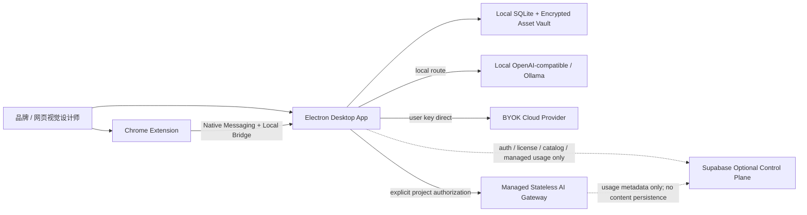
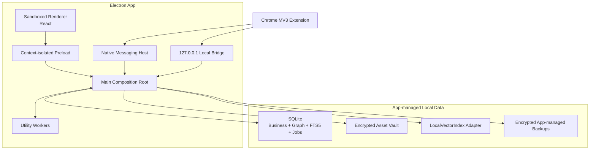

# DesignWan 本地优先技术栈与系统架构

版本：v2.0  
状态：MVP 架构基线  
适用范围：个人版桌面端 MVP；浏览器扩展；可选云控制面与三类 AI Route  
关联文档：[PRD](../product/PRD.md) · [本地数据模型](DATA_MODEL.md) · [AI 契约与评测](AI_CONTRACTS_AND_EVALS.md)

## 1. 结论先行

- **主应用**：Electron + React + TypeScript 桌面端。Electron Main 是唯一可信组合根；Renderer 开启 Sandbox、Context Isolation、关闭 Node Integration，只通过窄 Preload Interface 请求能力。
- **进程模型**：Main 负责窗口、授权、IPC、密钥协调和事务入口；Utility Worker 负责可取消的 AI、Embedding、导入、抓取解析和重建任务。Renderer 与 Extension 都不能直接打开数据库、文件库或密钥。
- **本地事实源**：单设备 SQLite 是素材、项目、决策、记忆、Graph、FTS5、Job 与删除状态的规范事实源。不存在云端业务数据库，也不以 Supabase/PostgreSQL/RLS/pgvector 作为业务真相。
- **本地文件库**：Asset 原件、预览、导入原文和可恢复删除副本进入应用管理的加密文件库；SQLite 只保存对象引用、Hash、版本、Scope 和加密元数据。
- **本地检索**：SQLite FTS5 承担关键词检索。向量检索位于 `LocalVectorIndex` Seam；M0 必须比较候选 `sqlite-vec` Adapter 与 Exact-search Test Adapter。`sqlite-vec` 仍是 pre-v1，不能让其表结构和 SQL 泄漏进业务 Module。
- **密钥**：OS Keychain/DPAPI/Secret Service 由 Electron `safeStorage` Adapter 封装，用于保护本地主密钥；敏感数据库字段和文件采用 Envelope Encryption。具体 Cipher/Key Adapter 在 M0 通过跨平台、轮换、恢复和大文件流式测试后才冻结。
- **浏览器扩展**：Chrome MV3 扩展通过 Native Messaging 完成 Host 身份、版本与一次性会话握手；小型 JSON 命令走 Native Messaging，较大文件走仅绑定 `127.0.0.1` 的 Local Bridge，要求短时 Token 与 Extension Origin Allowlist。
- **离线队列**：App 关闭时，Extension 只在 IndexedDB 保存有限、加密/最小化的待传项；有数量、字节、时间上限。Host 恢复后握手、重放、逐项确认，不能无限囤积网页与截图。
- **Supabase 角色**：只作为可选控制面：Auth、License、Billing、Model Catalog、Managed AI Usage。不得存业务正文、素材、项目、记忆、Embedding、原始 Prompt/输出或 Extension 队列。Singapore `ap-southeast-1` 只描述控制面主区域。
- **AI 三路**：Local OpenAI-compatible/Ollama Adapter；BYOK Direct Cloud Adapter；Managed Stateless Gateway Adapter。每个 Project 单独授权 `external_ai`；Managed Gateway 只中转，不持久化内容。
- **AI 预算**：`$15` Soft / `$20` Hard 仅适用于 Managed Route 的平台代付成本；Local 和 BYOK 不计入平台预算，但仍受 Project Policy、模型能力、Evals 和用户设备/供应商限制。
- **删除**：T0 Tombstone 并立即排除 App DB/FTS/vector/graph/cache/jobs；T+7 内可恢复，T+8 起 Purge，App 实际运行时最迟 T+30 完成本地应用管理面证书。设备未运行时不能宣称远程擦除。

## 2. 数据主权与非目标

### 2.1 本地优先的严格含义

以下内容默认只存在用户设备：

- Asset 原件、截图、Fragment、预览和导入文件；
- Project、Client、需求原文、判断、证据、Decision、反馈和复盘；
- Memory、Memory Evidence、个人词典、UserModel；
- FTS、Embedding、Graph、检索反馈和派生摘要；
- 原始 Prompt、Context Pack、Provider 原始输出和 Tool Trace；
- Extension 待传队列、App Job Payload、应用管理备份。

“本地优先”不是先写云端再同步回来，也不是把正文藏进一个 JSONB 后假装没有上云。任何云传输必须属于用户明确选择的 AI Route，并受具体 Project Policy 约束。

### 2.2 云控制面允许的数据

Supabase 控制面只允许：

- Account ID、登录身份与设备授权的最小元数据；
- License、Entitlement、Billing Customer 引用；
- 去内容化 Model Catalog、Capability/Eval Approval 和 Route 状态；
- Managed AI 的计费计数、Token/图片数量、费用、错误类别、Route/版本与不可逆请求关联摘要；
- 版本检查、Feature Availability 和必要安全撤销信息。

控制面禁止保存：

- 任何业务正文、文件、图片、向量、图关系和记忆；
- 原始 Prompt、Context、Provider Request/Response 或 Tool Output；
- 可还原用户设计项目的文件名、URL、Client 名称或语义标签；
- Local/BYOK 的内容、密钥或完整调用日志。

## 3. 运行时与信任分区

### 3.1 进程职责

| 进程 | 可信度 | 允许 | 禁止 |
|---|---|---|---|
| Electron Main | 高 | Composition Root、IPC 验证、事务入口、KeyProtector、窗口/协议/Bridge 生命周期 | 渲染复杂 UI、执行长时间 CPU/AI 任务 |
| Preload | 最小特权桥 | 暴露版本化、参数校验后的窄 Interface | 暴露 `ipcRenderer`、文件路径、数据库句柄、任意 channel |
| Renderer | 不可信 UI | 展示状态、提交 Intent、接收脱敏 View Model | Node Integration、`require`、直接文件/DB/Keychain/网络密钥访问 |
| Utility Worker | 受控执行 | AI/Embedding/导入/解析/重建、可取消任务 | 自行放宽 Scope/Policy、直接向 Renderer 暴露、持有长期主密钥 |
| Native Host | 受控桥 | 验证 Extension Origin、握手、转发小型命令、签发 Bridge Token | 接受未登记 Extension、持久化业务内容、把 stdout 当日志 |
| Local Bridge | 短时本机通道 | 接受已握手、短时 Token、限定大小/类型的本地上传 | 绑定 `0.0.0.0`、长期监听、Cookie 身份、任意 Origin |

Electron 官方将 Context Isolation 与 Renderer Sandbox 列为安全基线；Preload 不能直接透传通用 IPC。实现必须遵循 [Context Isolation](https://www.electronjs.org/docs/latest/tutorial/context-isolation)、[Process Sandboxing](https://www.electronjs.org/docs/latest/tutorial/sandbox) 和 [Security Checklist](https://www.electronjs.org/docs/latest/tutorial/security)。

### 3.2 Renderer 安全基线

- `sandbox: true`、`contextIsolation: true`、`nodeIntegration: false`。
- 只加载打包的本地应用资源；远程网页不进入主 Renderer。
- 严格 CSP；禁止任意导航、新窗口和未经校验的 `openExternal`。
- Preload Interface 按业务动作拆分，例如 `capture.submit`、`asset.query`、`project.command`，不暴露 `send(channel, payload)`。
- 每条 IPC 校验 Sender、Window、Schema、Actor Session、Project Scope、请求大小与幂等键。
- IPC 返回 View Model 或结果引用，不返回本地绝对路径、主密钥、Provider Key、SQLite 错误堆栈。

### 3.3 Main 与 Utility Worker

Utility Worker 使用 Electron `utilityProcess`，通过 MessagePort 与 Main 通信。Main 是数据库写入仲裁者：Worker 提交类型化 Command/Result，不能长期各自打开 SQLite 写连接形成锁竞争。需要只读快照的 Worker 由 `LocalStore` Module 提供受控查询或一次性只读通道。

任务规则：

- SQLite Job 表提供至少一次执行语义；Handler 必须幂等。
- Worker 领取后复核目标版本、Tombstone、Project AI Policy、模型 Route 和取消状态。
- 长任务必须有租约、心跳、取消、阶段进度和资源上限。
- Worker 崩溃只留下可重放 Job，不留下“半个规范事实”。

## 4. 系统上下文



核心断言：删除网络后，除云登录、License 刷新、目录更新和云 AI 外，采集整理、项目判断、记忆、FTS、Graph、已有本地向量召回均可继续。

## 5. 桌面容器图



Main 不应成为几万行“上帝文件”。它只负责 Composition Root、权限/IPC、进程协调和 Electron 生命周期；业务规则仍放在 Deep Module。

## 6. Deep Module 与依赖方向

| Module | 小 Interface | 隐藏的 Implementation |
|---|---|---|
| Capture | 接收采集、查询状态、重放离线项 | Native Host/Bridge 握手、Hash、幂等、Extension Queue Ack、导入配额 |
| Assets | 查询/编辑/Fragment/删除 | SQLite 事务、Vault 对象、预览、加密、引用占位、删除传播 |
| Projects | 需求、判断、证据、Decision、复盘 | 认知类型、版本、Scope、AI 草稿、离线状态 |
| Memory | propose/review/recall/forget | 确认门、冲突、衰减、FTS/vector/graph、删除与反回音壁 |
| Retrieval | search(request) | Scope-first FTS5、LocalVectorIndex、Graph、RRF、Rerank、降级 |
| Graph | assert/challenge/neighborhood | SQLite 邻接表、本体、证据、有限路径、孤儿清理 |
| LocalStore | transact/query/migrate/health | SQLite Driver、WAL、Busy Retry、Migration、Integrity Check、单写仲裁 |
| AssetVault | put/read/delete/verify | 分块加密、DEK、对象布局、Hash、原子落盘、垃圾清理 |
| LocalVectorIndex | upsert/remove/search/rebuild/health | sqlite-vec 或 Exact Adapter、版本空间、索引迁移、性能指标 |
| KeyProtector | wrap/unwrap/rotate/availability | Electron safeStorage、OS Keychain/DPAPI/Secret Service、测试 Adapter |
| AI Gateway | run(capabilityRequest) | 三 Route、ModelCatalog、Project Policy、Schema、成本、Fallback、追踪 |
| Deletion | request/restore/status/verify | T0/T+7/T+8/T+30、DB/Vault/Index/Queue/Backup 传播与证书 |

依赖方向：

```text
Renderer / Extension
  -> Preload / Native Host / Local Bridge
  -> Desktop Commands
  -> Business Modules
  -> LocalStore / AssetVault / LocalVectorIndex / AI Gateway ports
  -> concrete Adapters
```

业务 Module 不 Import Electron、SQLite Driver、`sqlite-vec`、Provider SDK、HTTP Server 或 Chrome Extension 类型。

## 7. 本地数据、FTS 与向量

### 7.1 SQLite

- SQLite 是规范业务、Graph、FTS5、Job/Outbox、配置和删除状态的单设备事实源。
- Main 统一写入；所有规范变更与 Outbox/Job 在一个 SQLite 事务提交。
- 启用 Foreign Keys、WAL、Busy Timeout、应用级 Migration、启动 Integrity Check 与异常关闭恢复测试。
- SQLite 不提供多租户 RLS。本地权限由 Main 恢复的 Actor/Workspace/Project Context 与 Module Policy 执行；Renderer 输入的 `workspace_id/project_id` 不可信。
- `fts5` Virtual Table 只索引允许检索且未 Tombstone 的规范化 Representation；T0 必须同步删除或使其不可命中。

### 7.2 加密 Asset Vault

- 对象按随机 Object ID 组织，不用 Client/Project/文件名作为路径。
- 每个对象或小聚合使用独立 DEK；Ciphertext 与认证标签写入 Vault，SQLite 保存 `key_ref`、算法/版本、Hash、大小和状态。
- 写入流程为临时文件 → 流式加密/Hash → fsync/校验 → 原子 Rename → SQLite 提交引用；失败由 Orphan Scanner 清理。
- 文件名、来源 URL 和敏感说明本身也可能敏感，不能因为“文件已加密”就明文散落日志和数据库。

### 7.3 LocalVectorIndex

稳定 Interface：

- `upsert(records, indexVersion)`
- `remove(entityRefs)`
- `search(queryVector, filters, limit)`
- `rebuild(targetVersion)`
- `health()`

候选生产 Adapter 是 `sqlite-vec`，但官方项目明确其仍为 pre-v1、可能发生破坏性变更，参见 [sqlite-vec](https://github.com/asg017/sqlite-vec)。因此：

- `vec0` 表、Extension Loading 和 SQL 只能存在于 Adapter 内。
- 业务表只保存向量记录元数据与 Index Version，不直接依赖 `vec0` RowID。
- 必须有 Exact-search Adapter 作为测试 Oracle 和小数据降级路径。
- M0 验证 Electron 打包、macOS/Windows 签名、Extension 加载、维度迁移、删除、重建、召回一致性与性能。
- Spike 不通过时，Beta 使用 Exact Adapter + 明确规模上限，不能让本地优先项目被一个 pre-v1 扩展绑架。

## 8. Browser Extension 通道

### 8.1 Native Messaging

Native Messaging 只传控制消息、元数据和小型 Payload：

1. Extension 请求连接 Native Host。
2. Host 校验 Native Manifest 的 `allowed_origins` 与调用 Origin。
3. 双方交换 Extension/App Version、协议版本、随机 Nonce。
4. Main 签发一次性 Session ID 与能力清单。
5. 每条消息带 Session、Sequence、Idempotency Key 和 Schema Version。

Chrome 官方限制 Native Host 到 Chrome 的单条消息最大 1 MB，Native Manifest 也要求显式 `allowed_origins`，参见 [Native Messaging](https://developer.chrome.com/docs/extensions/develop/concepts/native-messaging)。因此截图、整页 HTML、PDF 和批量文件不得 Base64 塞进 stdio JSON。

### 8.2 Local Bridge

大文件通道必须同时满足：

- 只绑定 `127.0.0.1`；不监听 LAN/公网地址。
- App 有活动握手时按需启动；空闲超时关闭；端口随机。
- Native Messaging 返回一次性短时 Bearer Token、目标 URL、允许 Content-Type/Size/Hash。
- 校验 `Origin: chrome-extension://<approved-id>`；Origin Allowlist 与 Native Manifest 一致。
- Token 绑定 Session、Extension ID、单一操作、最大字节、过期时间和 Nonce；成功一次即失效。
- 不使用 Cookie、长期 Token、查询字符串 Secret；失败日志不写文件内容/Token。
- 先写隔离临时区，校验 Hash/类型/大小后再交给 AssetVault。

### 8.3 App 关闭时

Extension IndexedDB Queue 只保存最小任务：

- 默认最多 500 项、总计 1 GB、最长 7 天；三项任一先到即停止接收并提示用户。
- 优先保存 URL、标题、用户原因和小预览；高敏截图/正文需本地加密能力可用，否则不排队。
- 每项含 Client Item ID、Hash、创建时间、重试次数与过期时间。
- App 恢复后逐项发送并等待 Ack；Ack 前不删除，幂等键防止重复 Asset。
- Extension 卸载、浏览器清理或设备故障会丢队列，UI 必须诚实提示“尚未进入 App”。

## 9. AI 三 Route

| Route | Adapter | 内容路径 | 平台预算 |
|---|---|---|---|
| Local | OpenAI-compatible / Ollama | 设备内或用户局域网明确端点 | 不计 `$15/$20` |
| BYOK Direct | OpenAI/Anthropic/Google 等直连 | App → Provider；Key 由 KeyProtector 保存 | 不计平台预算 |
| Managed | DesignWan Stateless Gateway | App → Gateway → Provider；只中转，不持久化内容 | 计 `$15/$20` |

共同门禁：

- Project `external_ai`: `deny | local_only | byok_allowed | managed_allowed | explicit_route_allowlist`。
- Capability + Prompt/Schema + Evals Approval。
- Vision/Embedding/Structured Output/Context 能力兼容。
- 用户默认与任务覆盖只从当前 Route 的 Eligible Catalog Entry 中选择。
- 禁止外部 AI 时，手工整理、FTS5、Graph、Exact/既有本地向量继续。

Managed Gateway：

- Request/Response Body 不进入数据库、对象存储、日志、Trace Attribute、Error Tracker 或死信队列。
- 只记录计费元数据、Route/版本、Token/图片计数、费用、状态/错误类别与不可逆请求摘要。
- 重试必须在内存短生命周期内完成；不能把正文放到云 Queue。
- Provider 自身保留/训练政策需逐 Route 展示；“Gateway 无状态”不代表下游 Provider 无保留。

## 10. 密钥与本地加密

### 10.1 Key Hierarchy

```text
OS Keychain / DPAPI / Secret Service
  -> Electron safeStorage Adapter wraps App Master Key
  -> Master Key wraps per-object/per-record DEKs
  -> DEKs encrypt sensitive DB fields, Asset files, Prompt/Output and App backups
```

Electron `safeStorage` 只能说明使用 OS 提供的加密系统保护字符串，且不同平台/Secret Store 的语义不同；它不是自动加密整个 SQLite 和文件目录。参见 [Electron safeStorage](https://www.electronjs.org/docs/latest/api/safe-storage)。

### 10.2 M0 必须验证

- `safeStorage` 异步可用性、临时不可用、Key Rotation、换系统账户和无 Keyring Linux 行为。
- Envelope Cipher 候选的认证加密、流式大文件、崩溃恢复、Nonce 唯一性、密钥轮换和删除回执。
- 敏感 SQLite 字段无法被明文 `strings`/取证扫描命中；临时文件、WAL、Crash Dump 和日志无明文。
- App-managed Backup 能恢复且保持加密；丢失 OS Keychain 时产品能否恢复必须明确，不能设计一个“安全到连用户自己也莫名其妙进不去”的黑箱。
- BYOK Key 永不进入 Renderer、日志、控制面或 Managed Gateway。

在 M0 Gate 通过前，文档只能写“候选 Adapter”，不能宣称已实现全盘数据库加密。

## 11. 删除、恢复与证书

| 时点 | 行为 |
|---|---|
| T0 | SQLite 同事务写 Tombstone，立即排除业务查询、FTS5、LocalVectorIndex、Graph、Cache、Job、AI Context；Extension Queue 同步下发删除标记 |
| T0–T+7 | App-managed 加密恢复副本可恢复；被删内容仍不得参与召回 |
| T+8 起 | App 运行时 Purge DB 正文、Vault、FTS、vector、graph、cache、jobs、Extension Queue 与 App-managed Backups |
| T+30 | 以“累计 App 活跃时间/下一次启动补偿”为执行条件完成应用管理面验证与证书；设备持续关闭时状态必须是 `pending_device_execution` |

证书覆盖：

- App SQLite 规范表与敏感字段；
- Encrypted Asset Vault、临时文件和预览；
- FTS5、LocalVectorIndex、Graph、Cache、Jobs/Outbox；
- Extension IndexedDB Queue（在 Extension 可通信时）；
- App-managed Backups。

证书明确排除：

- OS/APFS/NTFS 快照、iCloud/OneDrive/Dropbox、Time Machine、第三方备份和取证副本；
- 用户自行导出、复制或截图；
- Local AI/BYOK/Managed 下游 Provider 的保留；它们按各自政策/合同处理；
- 设备长期离线、App 被卸载或磁盘不可访问时无法执行的擦除。

删除证书不是宇宙级“所有字节消失证明”。它只证明 DesignWan 可控制的本地介质已检查；无法访问的 Extension、离线设备和第三方留存必须显示为排除项/待处理项。

## 12. 冷启动导入与任务

保留 Beta 配额：

- 500 文件/批；
- 每个本地 Workspace 1 active + 1 queued；
- 每个 UTC 自然日 2,000 个接收文件。

配额主要保护本机 CPU、磁盘和 AI 成本，不是云存储限制。SQLite 事务锁定 UTC 日计数器并依赖 Batch 状态唯一约束；501 文件返回 `422`，第三批/日限额返回 `429`。Local/BYOK AI 不进入平台预算，Managed 分析逐 Run 进入 `$15/$20` Ledger。

App 关闭时 Job 保持 SQLite queued/retry_wait；下次启动恢复。不能用远程 Worker 在用户不知情时继续处理本地内容。

## 13. Monorepo 结构

```text
designwan/
├─ apps/
│  ├─ desktop/
│  │  ├─ src/main/               # Composition Root、窗口、IPC、协议、生命周期
│  │  ├─ src/preload/            # 窄 ContextBridge Interface
│  │  ├─ src/renderer/           # React UI；无 Node/DB/Keychain
│  │  ├─ src/workers/            # Utility Process Entrypoints
│  │  └─ src/native-host/        # Native Messaging Host / installer
│  └─ browser-extension/         # MV3、IndexedDB Queue、Native/Bridge client
├─ packages/
│  ├─ modules/
│  │  ├─ capture/
│  │  ├─ assets/
│  │  ├─ projects/
│  │  ├─ decisions/
│  │  ├─ memory/
│  │  ├─ retrieval/
│  │  ├─ graph/
│  │  └─ deletion/
│  ├─ platform/
│  │  ├─ local-store/            # SQLite Adapter + Migrations + health
│  │  ├─ asset-vault/            # Encrypted file Adapter
│  │  ├─ vector-index/           # LocalVectorIndex Interface + Adapters
│  │  ├─ key-protector/          # safeStorage + Test Adapter
│  │  ├─ ai/                     # Local/BYOK/Managed Adapters
│  │  ├─ control-plane/          # Optional Supabase client, metadata only
│  │  ├─ local-bridge/           # Loopback transfer protocol
│  │  └─ telemetry/              # Local-first, redacted telemetry
│  ├─ contracts/
│  │  ├─ ipc/
│  │  ├─ native-messaging/
│  │  ├─ bridge/
│  │  ├─ jobs/
│  │  └─ ai/
│  └─ ui/
├─ sqlite/
│  ├─ migrations/
│  ├─ seeds/
│  └─ integrity/
├─ control-plane/
│  └─ supabase/migrations/       # Auth/license/billing/catalog/managed usage only
├─ prompts/
├─ evals/
└─ tests/
   ├─ ipc-security/
   ├─ native-bridge/
   ├─ sqlite/
   ├─ encryption/
   ├─ vector-index/
   ├─ deletion/
   └─ ai-routes/
```

`control-plane` 不能 Import 业务 Module 的实体类型或数据库 Migration；共享只允许去内容化 ID、Entitlement、Catalog 与 Usage 契约。

## 14. M0 前置 Spike 与 Go/No-Go

开发主功能前必须完成：

1. **Electron Security Spike**：Sandbox/Context Isolation、窄 Preload、IPC Sender/Schema、CSP、Fuses、打包后安全回归。
2. **SQLite Spike**：Main 单写 + Utility Worker 压力、WAL/Busy、崩溃恢复、Migration、FTS5 中文策略、10k/100k 规模基线。
3. **Vector Spike**：`sqlite-vec` Electron 打包/签名/加载、Exact Adapter Oracle、过滤/删除/重建、维度迁移和性能；失败则 Exact Adapter 限量上线。
4. **Encryption Spike**：safeStorage KeyProtector、Envelope Cipher、WAL/Temp/Crash 明文扫描、大文件流式、轮换、备份恢复、Keychain 不可用。
5. **Extension Bridge Spike**：三平台 Native Host 安装、Origin Allowlist、1 MB Native Message、Loopback Token、重放/CSRF/恶意本机进程、App-off Queue。
6. **AI Route Spike**：Local Ollama/OpenAI-compatible、BYOK、Managed Stateless 三路统一 Schema；云侧内容零持久化验证与 Provider Retention 显示。
7. **Deletion Spike**：T0 全检索面失效、T+8 幂等 Purge、离线设备/Extension 不可达、App-managed Backup 清理与诚实证书。

任一安全关键 Spike 未通过，不得以“先做功能以后补”跨过 M0。那不是敏捷，是把风险藏进用户磁盘。

## 15. 测试与发布门

- Renderer 无 Node/SQLite/Keychain 能力；恶意 IPC/导航/Origin 全部拒绝。
- Native Host 只接受登记 Extension ID；Local Bridge 只监听 Loopback，过期/复用/错误 Origin Token 全拒绝。
- SQLite Migration 从零、跨版本、异常中断可恢复；Integrity Check 与备份恢复通过。
- FTS5/Graph/Vector 在 T0 后命中为 0；Exact Adapter 与候选向量 Adapter 的 Top-K 一致性达到门槛。
- 敏感 Fixture 不出现在 DB 明文字段、WAL、Temp、日志、Crash、控制面和 Managed Gateway Telemetry。
- 三 AI Route 分别跑 Capability/Schema/Source/Policy Evals；Managed Hard Cap 不能被用户换模型、Fallback 或重试绕过。
- 删除证书明确 Coverage、Exclusion、Pending；设备离线时不得标记完成。
- 构建产物覆盖 macOS/Windows；Native Host Manifest、Extension ID、签名和自动更新回滚单独验收。

## 16. 主要风险与 Trade-off

| 风险 | 判断 | 控制 |
|---|---|---|
| Electron 权限面大 | 本地文件/AI 需要可信进程，但 Renderer 不应拥有它 | Sandbox、Context Isolation、窄 Preload、IPC 安全测试 |
| SQLite 单写锁 | 个人版可接受；比云一致性简单 | Main 写仲裁、短事务、WAL、Worker 不直写 |
| sqlite-vec pre-v1 | 有打包和破坏性变化风险 | Adapter 隔离、Exact Oracle、M0 Gate、可退回 Exact |
| safeStorage 被误解为全盘加密 | 会制造虚假安全承诺 | KeyProtector + Envelope Cipher 分层、明文扫描、M0 验证 |
| 本地数据丢失 | 云端不存业务数据意味着设备故障风险更真实 | 加密 App-managed Backup、导出、恢复演练、清晰提示 |
| Extension Bridge 被本机攻击 | Loopback 不是天然可信 | Origin + 短 Token + Nonce + 限大小 + 一次性操作 |
| Managed Stateless 被过度承诺 | Gateway 无持久化不等于 Provider 无留存 | Route Policy、Provider 披露、项目授权、契约/Eval |
| 离线删除 SLA | App 不运行就无法执行 | pending 状态、启动补偿、Coverage/Exclusion 证书 |
| 控制面偷长成业务面 | 最容易重新破坏本地优先 | 独立包/Schema、字段 Allowlist、DLP 契约测试 |

## 17. ADR 清单

- ADR-001：Electron + React + TypeScript 本地优先桌面端。
- ADR-002：Sandboxed Renderer、Context Isolation 与窄 Preload Interface。
- ADR-003：SQLite + FTS5 为本地规范业务/Graph/Job 事实源。
- ADR-004：Encrypted Asset Vault 与 KeyProtector/Envelope Encryption。
- ADR-005：LocalVectorIndex Seam；sqlite-vec Spike + Exact Adapter。
- ADR-006：Native Messaging 控制通道 + Loopback Local Bridge 文件通道。
- ADR-007：Supabase 仅可选控制面，Singapore 仅控制面主区域。
- ADR-008：Local / BYOK / Managed Stateless 三 AI Route。
- ADR-009：`$15/$20` 只约束 Managed Route。
- ADR-010：离线感知的 T0/T+7/T+8/T+30 删除与证书边界。

以上是开发基线。任何重新把业务正文、素材、记忆、Embedding 或原始 Prompt/输出写入云端的方案，必须视为产品方向变更，而不是“实现细节”。
