# MVP 用户流程与业务流程

版本：v1.2  
范围：面向首批品牌/网页视觉设计师的个人版 MVP 完整纵向闭环  
关联文档：[PRD](PRD.md)、[产品决策基线](PRODUCT_BASELINE.md)、[术语表](GLOSSARY.md)

## 1. 流程设计原则

- 桌面端是主产品和本地事实源，负责整理、理解、使用和控制；插件只是快速采集伴侣。
- 本地数据库与本地文件保存素材、项目、记忆及派生索引；Supabase 可选控制面不得保存业务正文、素材、记忆或原始 Prompt。
- 本地模式可离线完成核心流程；云 AI 必须逐项目授权，并在调用前说明向 Provider 发送的最小必要上下文。
- AI 是异步增强；原始素材和原始需求成功保存后，不等待 AI 才算“已接收”。
- 用户输入、原始事实、客户观点、AI 推断、假设和已确认结论必须区分。
- 用户可以中途退出、继续、撤销、重试、恢复和删除，不丢已经安全保存的输入。
- 业务流必须先执行本地 Workspace 所有权/会话、Client/Project 和 Memory Scope 校验；云 AI 还必须校验项目授权与最小必要上下文，再检索、图谱扩展或调用模型。
- MVP 必须跑到“第二个项目召回第一个项目确认的记忆”，不能停在素材库或聊天分析 Demo。

## 2. 用户流与业务流的边界

- **用户流 User Flow**：用户看见什么、做什么、得到什么反馈，强调任务完成路径。
- **业务流 Business Flow**：系统如何鉴权、落库、切换状态、触发异步任务、执行规则、形成审计和处理失败。

以下 18 条流程均分别给出用户流与业务流。Mermaid 图只使用稳定的 `flowchart` 语法；方括号节点文本使用双引号，避免中文标点导致解析歧义。

## 3. MVP 总闭环

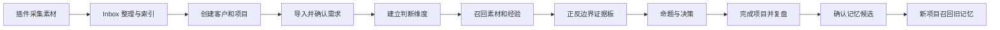

P0 端到端验收必须用两个不同项目证明最后一跳，且永久删除后不再召回。

## 4. 流程 01：首次启动与冷启动

### 用户流

```text
启动桌面端
→ 选择本地业务数据与应用管理备份位置
→ 创建本地个人 Workspace
→ 选择设计领域
→ 确认学习、跨项目召回与默认 AI 路由
→ 可选登录控制面账号，用于订阅、模型目录和 Managed Cloud AI 用量
→ 从受评测白名单选择默认模型，云路由仍须逐项目授权
→ 选择安装插件 / 导入历史资料 / 使用示例 / 跳过
→ 审阅初始分类与记忆候选
→ 进入 Inbox
```

### 业务流

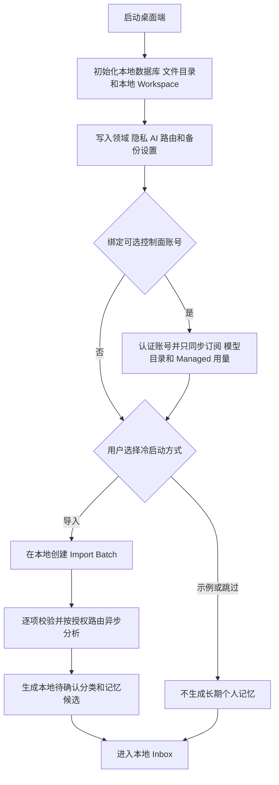

### 规则、异常与验收

- 基础冷启动支持通用图片/文件/文档/链接清单或浏览器书签导出；Eagle、Pinterest、Notion 专用连接器可后置。
- 导入容量锁定为每批最多 500 个文件；每个 Workspace 同时只允许 1 个活跃批次和 1 个排队批次；按 UTC 自然日最多接收 2,000 个文件。超过任一限制时不静默丢弃，需说明限制、当前批次和可再次提交时间。
- 导入部分失败时成功项不回滚，失败项可单独重试；用户可随时跳过。
- 冷启动推断只能进入 `Pending`，不得自动形成已确认审美偏好。
- 用户只可选择通过当前任务能力、质量、安全和隐私评测的模型；Local/BYOK/Managed 路由分开，默认模型不能绕过逐项目云授权。15/20 美元成本边界只适用于 Managed Cloud AI。
- 控制面账号不是创建本地 Workspace 的前置条件；控制面不可用时不得阻塞本地导入、整理、项目、记忆和检索。
- 可选账号认证失败只影响订阅、模型目录刷新和 Managed Cloud AI，不得回滚或锁住已经创建的本地 Workspace。
- 验收：不登录且离线的用户也能完成引导；控制面未出现业务正文、素材、记忆或原始 Prompt；删除导入批次后派生候选不可继续使用；第 3 个并发批次、单批第 501 个文件和 UTC 单日第 2,001 个文件被可解释地拒绝。

## 5. 流程 02：浏览器插件收藏

### 用户流

```text
点击插件/右键/快捷键
→ 选择保存链接、当前视口、完整网页、框选局部或页面单图
→ 查看标题、来源、预览与是否已收藏
→ 可填写“为什么收藏”和笔记
→ 选择 Inbox、项目或灵感板
→ 保存
→ 看到“桌面端已接收”或“扩展本地已排队”
```

### 业务流

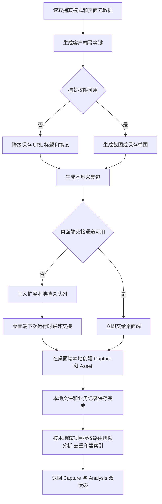

### 规则、异常与验收

- 原因可跳过；跳过后标记 `needs_context`。本地接收成功与 AI 分析成功分开展示。
- 精确重复提示补充已有素材上下文或保存为新采集，不静默复制或覆盖。
- 全页拼接失败时保留已捕获部分，并可降级当前视口；页面权限不足可只存链接。
- 验收：五种采集结果都保留来源并进入桌面端同一本地 Inbox；桌面端未运行时扩展仍可排队，下一次运行完成幂等交接；重复点击只创建一个 Capture；2 秒内有明确反馈。

## 6. 流程 03：素材进入收件箱

### 用户流

```text
插件交接或本地导入成功
→ 在 Inbox 立即看到原始素材卡片
→ 查看本地保存、分析、来源和是否待补上下文
→ AI 未完成时仍可打开、关联项目或删除
→ 分析完成或失败后收到状态反馈
```

### 业务流

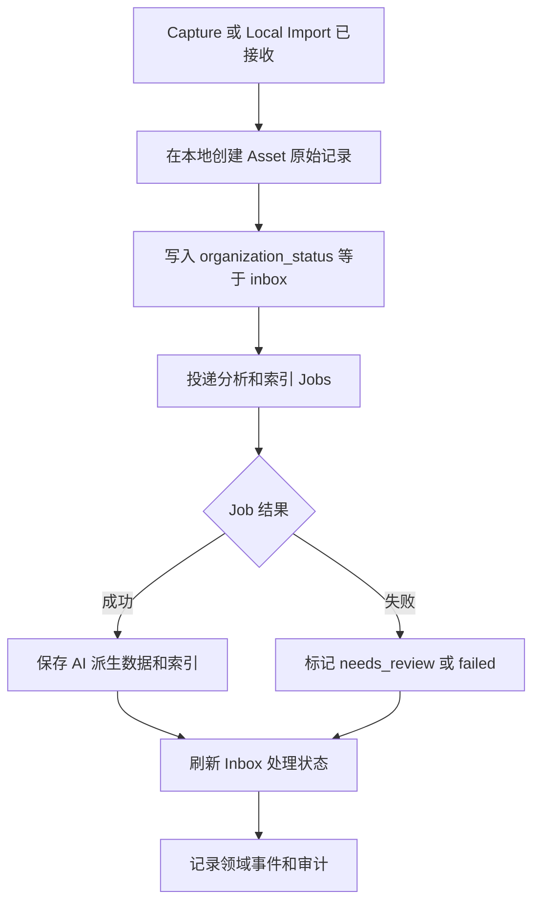

### 规则、异常与验收

- 三组状态正交：`ingestion_status`、`analysis_status`、`organization_status`，不能用一个 `status` 糊住全部过程。
- AI 失败不影响原始素材可用；来源和用户原因永远不被 AI 覆盖。
- 验收：用户无需刷新或重新导入即可看到素材；失败卡显示发生了什么、已保存什么、如何重试。

## 7. 流程 04：用户整理素材

### 用户流

```text
打开 Inbox 素材
→ 查看原始内容、来源、收藏原因与 AI 建议
→ 补充原因和笔记
→ 确认、修改、拒绝或忽略 AI 描述/标签
→ 可裁切 Fragment 并确认 Visual Feature
→ 关联项目/灵感板或保留在个人库
→ 标记已整理、归档或删除
```

### 业务流

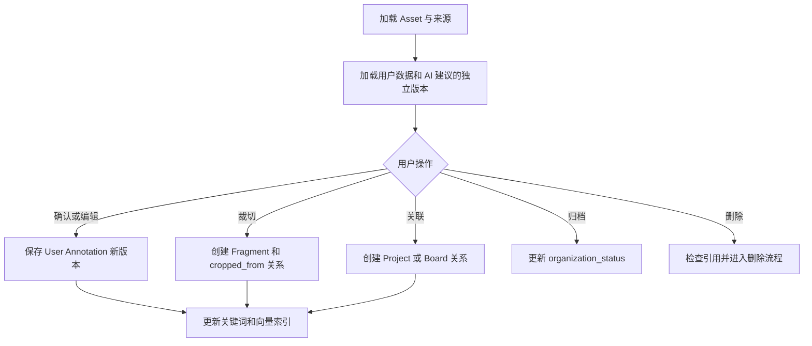

### 规则、异常与验收

- 用户标签/描述与 AI 标签/描述分开存；正向/反向/边界是项目关系，不是素材永久属性。
- Fragment 保留裁切坐标、来源 Asset 和用户关注点；Visual Feature 可以关联多个 Asset/Fragment。
- 删除被决策引用的素材先展示影响范围；T0 软删除且立即停止召回，T+7 前可恢复，T+8 起按统一硬删除流程清理；历史决策只保留不含正文的“证据已删除”占位。
- 验收：用户不接受任何 AI 标签也能完成整理；裁切局部可独立搜索和加入项目。

## 8. 流程 05：素材搜索和召回

### 用户流

```text
输入关键词或自然语言设计意图
→ 可选择项目、客户、来源、时间、案例角色和排除风格
→ 查看素材、局部和历史作品结果
→ 阅读每条“为什么召回”
→ 打开、加入项目/板、标记不相关或继续改写查询
```

### 业务流

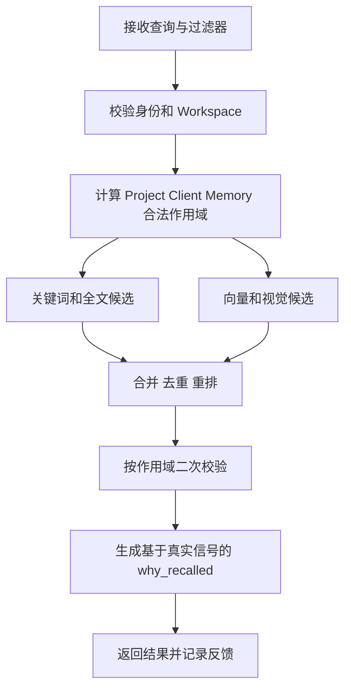

### 规则、异常与验收

- 作用域过滤必须在候选生成前执行，并在返回前二次校验；不得先全库向量搜索再依赖前端隐藏。
- 向量不可用时降级关键词/全文；无结果可建议改写或扩大到个人通用素材，但不得自动扩大到其他客户。
- “不相关”反馈只用于检索质量，不直接形成长期审美记忆。
- 验收：结果提供命中理由和作用域；关键词、自然语言、向量、基础视觉相似、局部和反向案例搜索可工作或明确降级。

## 9. 流程 06：创建客户和项目

### 用户流

```text
进入 Projects
→ 新建或选择 Client
→ 创建 Project
→ 填写项目名、设计领域、交付类型和可选时间信息
→ 设置私密、学习与跨项目召回
→ 选择 Local/BYOK/Managed/Manual 路由；如选择云 AI，查看 Provider 与最小必要上下文并逐项目授权
→ 设置全网搜索
→ 创建并进入 Project Workspace
```

### 业务流

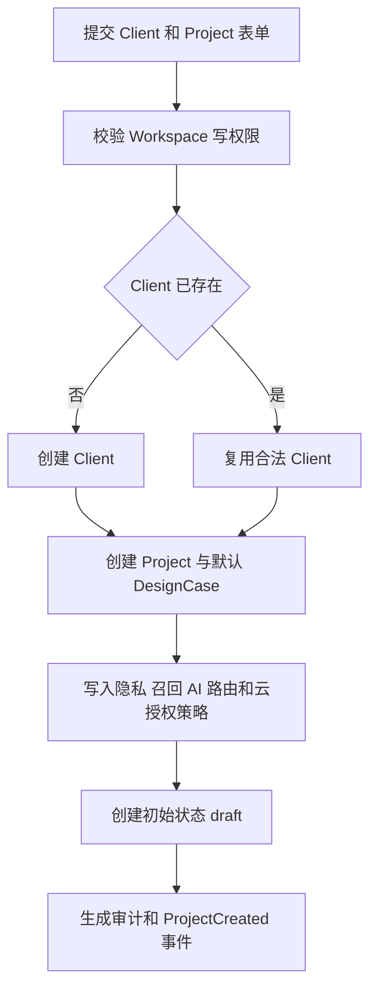

### 规则、异常与验收

- Client 可为空，系统使用“未指定客户”，但不得因此开放跨客户召回。
- 项目策略默认继承 Workspace，用户可收紧；放宽敏感策略需明确确认。
- 云 AI 默认 `denied`；BYOK 与 Managed Cloud 分别授权，授权必须显示 Provider、发送数据类型、最小必要上下文和可能留存边界。本地模型不需要云授权。
- 项目中途归档或重开保留状态历史；隐私变化立即让相关缓存和异步上下文失效。
- 验收：项目进入独立作用域；设置页面能解释本地事实源、Local/BYOK/Managed 路由、云授权和学习开关的差异；撤销云授权后新任务不得发送上下文。

## 10. 流程 07：导入甲方需求

### 用户流

```text
进入项目 Brief
→ 粘贴文本或从本地导入 PDF、Word、邮件、会议纪要、聊天截图、参考图等
→ 查看文件和解析状态
→ 补充资料类型、来源人和时间
→ 确认开始分析
→ 原始资料立即可查
```

### 业务流

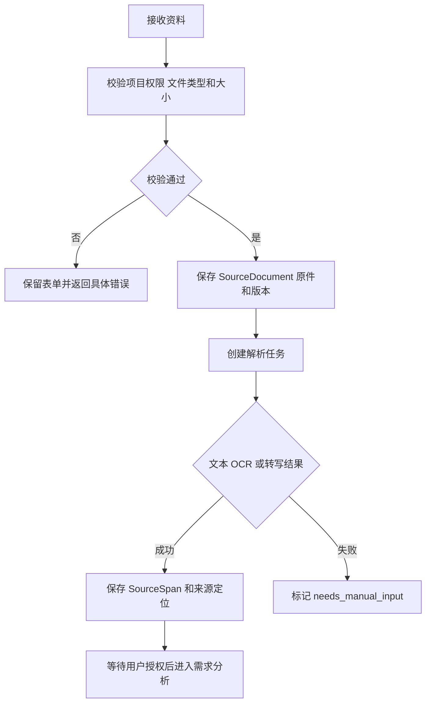

### 规则、异常与验收

- 原件和原始表达不可被 AI 改写覆盖；解析文本是可追溯派生版本。
- 资料过长分块并显示覆盖范围；OCR/转写失败允许粘贴或手工补录。
- 云 AI 未授权时只运行本地可处理的解析与已安装本地模型能力，并明确未运行云端分析；授权云 AI 时仅发送用户已确认的最小必要片段，原件仍只存在本地。
- 验收：原文、来源人、时间和版本可查；部分文件失败不阻塞其余资料。

## 11. 流程 08：需求拆解与确认

### 用户流

```text
发起需求分析
→ 查看原始表达、显性需求、隐性推测、目标、约束、模糊词、冲突、缺口、假设和追问
→ 查看每项来源、认知类型和置信度
→ 逐项确认、编辑、拒绝、合并或拆分
→ 补充客户答复
→ 确认需求分析版本
```

### 业务流

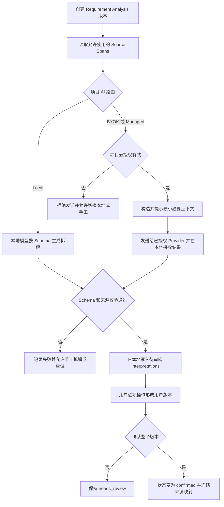

### 规则、异常与验收

- 每项必须标注 `fact`、`client_opinion`、`user_judgment`、`ai_inference`、`hypothesis` 或 `validated_conclusion`。
- AI 无直接证据时必须标记，不得把隐性诉求混入显性需求。
- 重新分析创建新版本；旧决策继续绑定旧版本，不静默漂移。
- 验收：所有 AI 项有来源或“无直接证据”；AI 失败时用户可手工完成同一结构。

## 12. 流程 09：建立判断维度

### 用户流

```text
查看系统建议的判断维度
→ 对照需求、模糊词和追问结果
→ 新建、修改、合并、排序或删除维度
→ 为每个维度定义判断标准、正向信号、反向信号和初始验收标准
→ 确认用于召回和方案比较
```

### 业务流

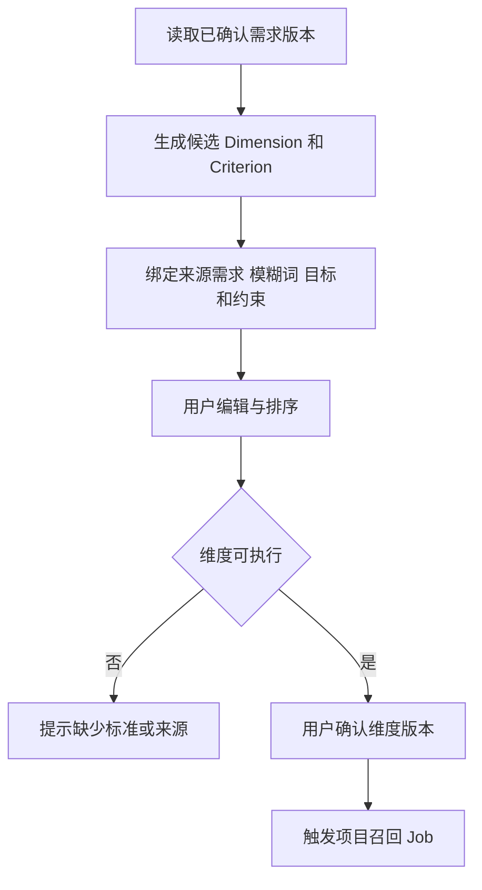

### 规则、异常与验收

- 判断维度不是标签，至少应说明比较什么、正/反向信号和证据来源。
- AI 可建议，用户必须确认后才驱动正式召回；维度修改产生版本。
- “高级”等模糊词优先引用项目/客户已确认词典语义，不自动套用个人通用含义。
- 验收：至少一个维度可追溯到需求/目标/约束，且用户可完全手工创建。

## 13. 流程 10：召回历史素材和经验

### 用户流

```text
确认判断维度
→ 选择允许的召回范围
→ 查看个人素材、Fragment、历史项目、作品、方法和已确认记忆
→ 阅读来源、历史使用和召回理由
→ 将结果加入证据板或标记不相关
→ 无结果时改写维度、手动搜索或合法扩大范围
```

### 业务流

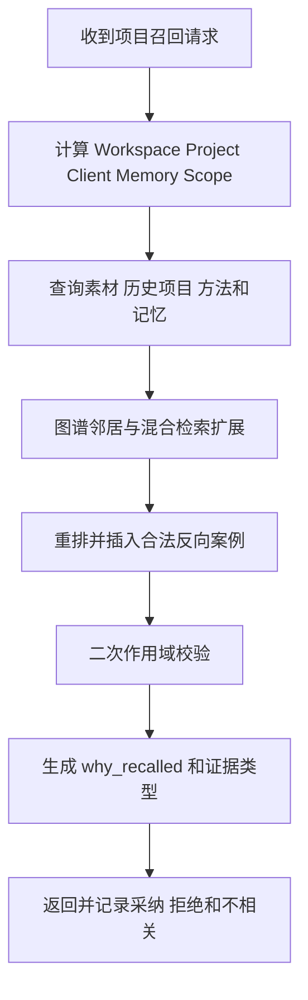

### 规则、异常与验收

- Client 记忆默认仅同客户；私密项目和 `do_not_learn` 内容不得越界。
- 召回结果区分“历史事实”“确认记忆”“AI 推荐”，不能混成同一权威等级。
- 无结果不能自动全网搜索；只有项目设置允许时才进入外部研究。
- 验收：每个结果可说明来源、作用域、召回路径；越界事件目标为 0。

## 14. 流程 11：组织正反案例

### 用户流

```text
打开 Evidence Board
→ 将素材、局部、作品或记忆放入正向、反向、边界/待判断
→ 写下支持或反对的具体局部与理由
→ 对照判断维度检查证据缺口
→ 请求反向案例或手工补充
→ 冻结当前板版本供命题使用
```

### 业务流

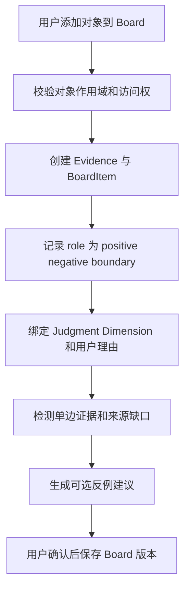

### 规则、异常与验收

- 同一素材可在不同项目扮演不同案例角色；角色存于关系上。
- AI 不能因为相似度高就自动标记正例；自动建议必须等待用户放入。
- 被删证据显示占位和原理由，不重写历史决策。
- 验收：每个 BoardItem 有判断维度和用户理由；系统可提示只有正例没有反证的风险。

## 15. 流程 12：创建设计命题

### 用户流

```text
选择需求、判断维度和证据
→ 手工编写或让 AI 起草一句设计命题
→ 补充支持证据、反证、假设、风险、实现代价和待验证项
→ 编辑并保存草稿
→ 标记探索中、候选、已选择、已拒绝或搁置
```

### 业务流

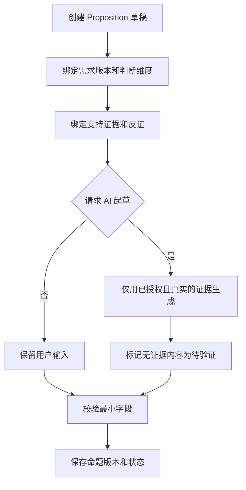

### 规则、异常与验收

- 命题不是最终设计稿，也不是空泛风格词；必须说明如何回应需求和承担何种 Trade-off。
- 无证据可保存草稿，但不能标记为已选择；AI 不得补写漂亮但不存在的项目理由。
- 验收：候选命题至少绑定一个需求/维度、一个支持证据和一项风险/反证。

## 16. 流程 13：记录决策

### 用户流

```text
比较候选命题
→ 选择、拒绝或搁置
→ 记录为什么选、为什么放弃、接受的代价、未验证假设和决策人
→ 绑定客户反馈或验证结果
→ 主动保存最终决策
→ 可生成面向客户、管理者、开发、团队或作品集的说明草稿
```

### 业务流

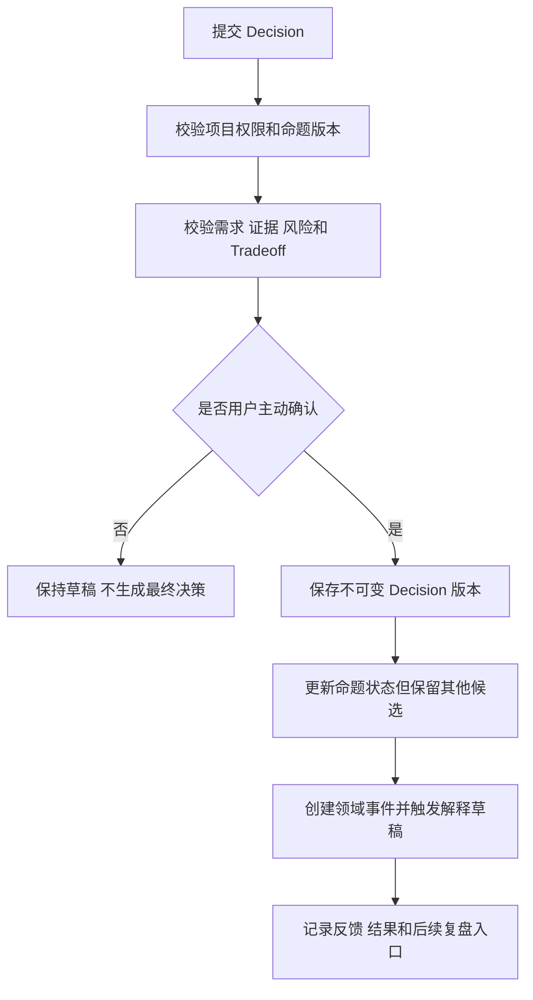

### 规则、异常与验收

- AI 不得自动宣布最佳方案；最终决策只能由用户主动保存。
- 解释必须基于真实需求、证据和权衡；缺失部分标为待补，不能编造。
- 决策绑定具体需求分析和证据板版本；后续修改创建新版本。
- 验收：关键理由均可回到证据；说明生成不自动发送给任何外部对象。

## 17. 流程 14：项目完成和复盘

### 用户流

```text
标记项目完成
→ 补充最终作品、客户反馈和结果
→ 查看 AI 复盘草稿
→ 核对需求变化、探索/否决方向、影响素材、有效/无效方法和被推翻判断
→ 区分可迁移、客户限定和项目限定结论
→ 编辑、确认并完成复盘
```

### 业务流

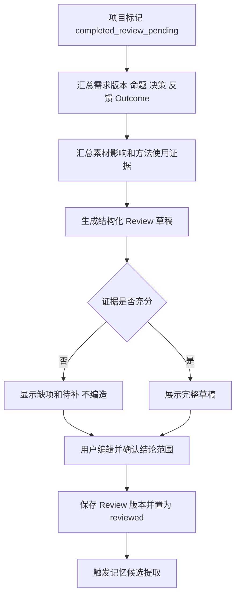

### 规则、异常与验收

- 复盘草稿未经用户确认不进入长期记忆。
- 项目重开后旧复盘不删除，标记可能过期；新完成阶段生成新版本。
- 缺少客户结果时明确“结果未知”，不能用设计师主观满意替代项目成效。
- 验收：基础复盘覆盖基线要求的十余项内容，并能区分经验适用范围。

## 18. 流程 15：生成记忆候选

### 用户流

```text
保存决策或确认复盘
→ 看到系统生成的记忆候选
→ 查看记忆类型、来源、支持/反向证据、置信度和建议作用域
→ 进入待确认列表
```

### 业务流

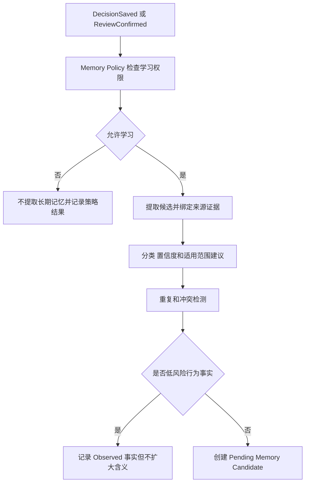

### 规则、异常与验收

- AI 不得绕过 Memory Policy 直接写长期记忆。
- 无来源、越过作用域或仅凭单次弱信号的重要推断不生成可确认长期记忆。
- 候选必须指出反向证据和适用/禁止范围；冲突候选不静默合并。
- 验收：长期审美、能力强弱、思维类型、判断原则等始终进入待确认。

## 19. 流程 16：用户确认或否定记忆

### 用户流

```text
打开待确认记忆
→ 查看系统“认为记住了什么”及证据
→ 选择确认、改写、限定范围、暂时偏好、禁止自动调用、否定或删除
→ 查看确认后的状态和未来调用规则
```

### 业务流

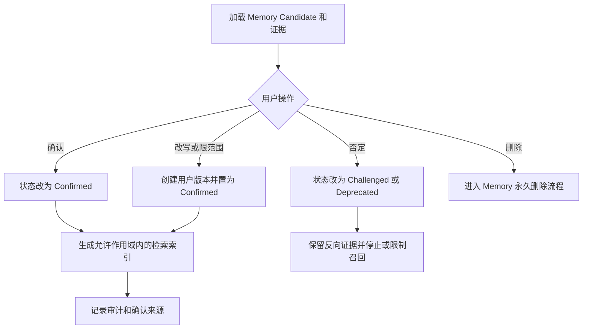

### 规则、异常与验收

- 用户确认的是具体表述和具体作用域，不是对隐藏人格模型的笼统授权。
- 相冲突记忆可并存，系统提示适用条件；不进行静默覆盖或简单取平均。
- 用户拒绝某候选，不自动推断成相反偏好。
- 验收：用户能查看、确认、编辑、限制、禁止调用、挑战、废弃和永久删除。

## 20. 流程 17：新项目召回旧记忆

### 用户流

```text
创建新项目并确认需求/判断维度
→ 查看“来自过去经验”的记忆卡
→ 阅读来源项目、证据、适用范围、最近验证和冲突提示
→ 采纳到当前判断、查看原项目、标记不适用或挑战
→ 当前使用结果成为新的证据
```

### 业务流

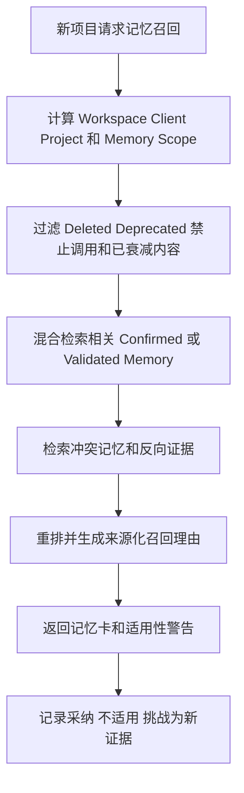

### 规则、异常与验收

- 当前项目/客户的更窄已确认语义优先，但不覆盖个人通用记忆。
- 只召回允许自动调用且处于 Confirmed/Validated 的内容；Challenged 可作为冲突提示而非建议结论。
- 记忆不适用反馈先成为证据，不自动删除旧记忆。
- 验收：项目 A 的确认记忆在合法项目 B 中可被召回；展示来源与边界；跨客户限制可验证。

## 21. 流程 18：删除项目和彻底删除记忆

### 用户流

```text
进入项目或记忆详情
→ 选择删除
→ 查看关联素材、决策、复盘、记忆和未来召回影响
→ 项目与个人记忆分别选择，不默认级联
→ 确认删除并立即从界面、搜索、召回和 AI 上下文中移除
→ 7 天内可从回收站恢复
→ 第 8 天起进入不可恢复的硬删除
→ 设备正常运行时最迟第 30 天查看 App 管理范围删除证明
→ 若设备长期未运行，查看 pending 状态并在下次启动继续清理
→ 通过搜索/召回验证对象不再出现
```

### 业务流

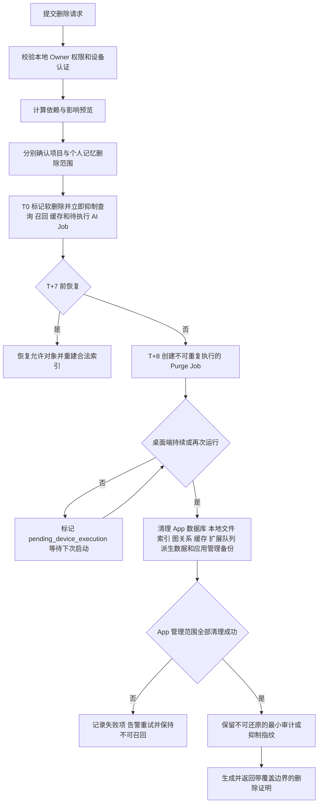

### 规则、异常与验收

- 项目删除与个人记忆删除是独立选择：删除项目不得隐式删除由其产生、且已确认的个人长期记忆；用户必须分别查看影响并单独选择。
- 本地 T0 立即停止界面展示、搜索、召回和 AI 上下文使用；T+7 前允许恢复；T+8 起不可恢复。设备正常运行时 T+30 前完成 App 管理范围清理并交付删除证明。
- 设备长期未运行时无法远程擦除本地副本；状态保持 `pending_device_execution`，下次桌面端运行继续。未完成前不得生成“已完成”证明。
- 抑制指纹只用于防止相同派生内容被旧事件重新生成，不保留记忆正文或可还原内容。
- 删除证明至少包含请求标识、对象范围、T0 时间、硬删除完成时间、清理层级、离线待处理状态和失败重试结果，不包含已删正文。
- 证明覆盖 App 数据库、本地文件、全文/向量索引、图关系、缓存、扩展队列、派生数据和应用管理备份；明确不覆盖 Time Machine、iCloud、系统快照、用户手工副本或外部 Provider 留存。
- 验收：T0 后搜索/召回/AI 上下文命中为 0；T+7 内可恢复且权限不扩大；T+8 后恢复被拒绝；设备运行条件下 T+30 前完成 App 管理范围清理；设备不运行时显示 pending 并在下次启动继续；失败可重试且全过程不可召回。

## 22. 关键对象状态机

### 22.1 素材状态

```text
capture_ingestion_status: extension_queued → handing_off → local_saved / failed
file_ingestion_status: local_import_queued → importing → local_saved / failed
analysis_status: not_started → queued → processing → ready / needs_review / failed / disabled
organization_status: inbox → organized → archived → deleted
```

### 22.2 需求分析状态

```text
draft → imported → analyzing → needs_review → confirmed → superseded
                         ↓
                       failed → retrying / manual_review
```

### 22.3 项目状态

```text
draft → active → direction_exploration → decision_recorded
→ completed_review_pending → reviewed → archived
```

### 22.4 设计命题状态

```text
draft → exploring → candidate → selected / rejected / on_hold → superseded
```

### 22.5 记忆状态

```text
observed / inferred → pending → confirmed → validated
                                      ↓          ↓
                                  challenged → deprecated → deleted
```

## 23. 端到端验收脚本

一个全新用户能够：

1. 不登录、离线启动桌面端并创建本地 Workspace，理解本地事实源、三类 AI 路由、学习和召回边界。
2. 通过插件分别完成链接/视口、全页、局部和单图采集中的代表性场景。
3. 在桌面端未运行时保存到扩展本地队列，桌面端下次运行后完成幂等交接，不把素材上传到控制面。
4. AI 未完成时在 Inbox 看到原始素材，并补充原因。
5. 裁切一个 Fragment，确认或拒绝 AI 描述。
6. 创建 Client 和项目 A，设置私密/学习策略；分别验证 Local、BYOK 或 Managed 路由，云路由必须逐项目授权并展示最小必要上下文。
7. 导入真实需求，看到带来源与认知类型的拆解并确认判断维度。
8. 召回个人素材/局部/经验并看到真实命中理由。
9. 组织正向、反向和边界案例，创建设计命题。
10. 记录带证据、反证和 Trade-off 的最终决策。
11. 完成项目并确认复盘中的可迁移/限定结论。
12. 生成一条有来源的记忆候选，并确认、改写或否定。
13. 创建项目 B，在合法作用域内召回项目 A 的已确认记忆。
14. 删除该记忆，确认其本地 T0 立即不再搜索、召回或进入 AI 上下文，T+7 前可恢复，T+8 后不可恢复；设备运行条件下 T+30 前取得覆盖 App 管理范围的删除证明，设备未运行时显示 pending 并在下次启动继续。
15. 删除项目 A，分别验证项目内容和保留/删除记忆的用户选择。
16. 检查 Supabase 控制面只存在账号、订阅、模型目录和 Managed 用量元数据，不存在业务正文、素材、记忆、原始 Prompt 或可重建向量。
17. 验证 15/20 美元阈值只作用于 Managed Cloud AI；本地模型和 BYOK 不被误停，且云 AI 撤权后不再发送新上下文。

缺少第 11–17 步，“持续学习设计师”和“Local-first”就都只是路演词，不是可验收的产品能力。

## 24. 全局失败与恢复清单

- 控制面断网、Managed Cloud 超时、重复点击、可选账号鉴权过期；以上均不得阻塞本地核心流程。
- 桌面端未运行、扩展交接失败、扩展队列在下次启动恢复。
- 截图权限拒绝、全页拼接失败、页面单图受限。
- 批量本地导入部分成功、部分失败。
- AI 返回空、非法 Schema、缺少来源或认知类型。
- Embedding/视觉索引失败导致语义或相似检索不可用。
- 文档过长、OCR/转写失败、格式无法解析。
- 用户中途退出、草稿恢复和 Job 继续。
- 并发编辑、版本冲突和重新分析。
- 删除被引用素材、项目或记忆。
- 隐私变化、跨客户拦截和缓存失效。
- 记忆重复、冲突、衰减、删除和派生数据清理。
- 删除期间设备长期未运行、清理 pending、应用管理备份失败和证明覆盖范围提示。

每个失败状态必须向用户说明：当前发生了什么、哪些数据已经安全保存、系统正在做什么、用户下一步可以做什么。
